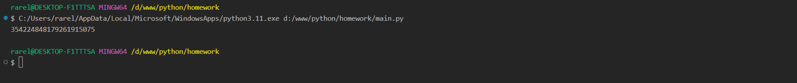
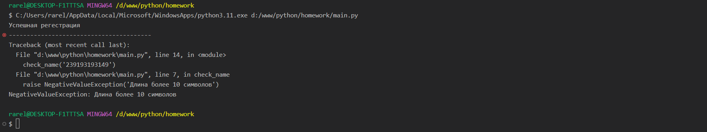
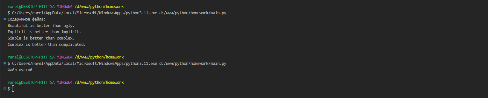
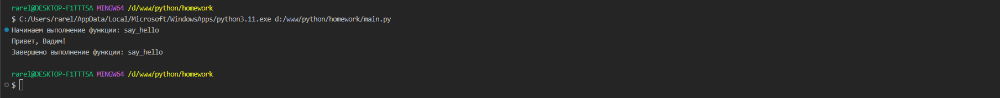

Тема 10. Декораторы и исключения
Отчет по Теме #10 выполнил(а):
- Сельков Вадим Андреевич
- АИС-22-1

| Задание | Лаб_раб | Сам_раб |
| ------ | ------ | ------ |
| Задание 1 | + | + |
| Задание 2 | + | + |
| Задание 3 | + | + |
| Задание 4 | + | + |
| Задание 5 | + | + |
| Задание 6 | - | - |
| Задание 7 | - | - |
| Задание 8 | - | - |
| Задание 9 | - | - |
| Задание 10 | - | - |

знак "+" - задание выполнено; знак "-" - задание не выполнено;

Работу проверили:
- к.э.н., доцент Панов М.А.

## Лабораторная работа №1
### 

```python


```
### Результат.


## Лабораторная работа №2
### 

```python


```
### Результат.


## Лабораторная работа №3
### 

```python


```
### Результат.


## Лабораторная работа №4
### 

```python


```
### Результат.


## Лабораторная работа №5
### 

```python


```
### Результат.


## Самостоятельная работа 1
### 

```python


```

### Результат.


## Вывод

## Самостоятельная работа 2
### 

```python


```

### Результат.



## Вывод

## Самостоятельная работа 3
### 

```python


```

### Результат.


## Вывод

## Самостоятельная работа 4
### 

```python


```

### Результат.



## Вывод


## Самостоятельная работа 5
### 

```python


```

### Результат.


## Вывод


## Общие выводы по теме


