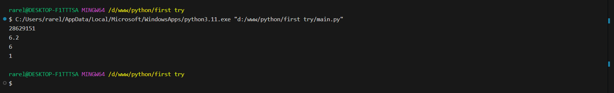
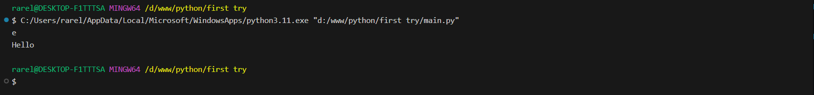

# Тема 2. Базовые операции языка Python
Отчет по Теме #2 выполнил(а):
- Сельков Вадим Андреевич
- АИС-22-1

| Задание | Лаб_раб | Сам_раб |
| ------ | ------ | ------ |
| Задание 1 | + | - |
| Задание 2 | + | - |
| Задание 3 | + | - |
| Задание 4 | - | - |
| Задание 5 | - | - |
| Задание 6 | - | - |
| Задание 7 | - | - |
| Задание 8 | - | - |
| Задание 9 | - | - |
| Задание 10 | - | - |

знак "+" - задание выполнено; знак "-" - задание не выполнено;

Работу проверили:
- к.э.н., доцент Панов М.А.

## Лабораторная работа №1
### Выведите в консоль три строки. Первая – любое число. Вторая – любое число в виде строки. Третья – любое число с плавающей точкой.

```python
print(123)
print('123')
print(1.23)
```
### Результат.


## Выводы

В данном коде выводятся три строки с использованием функции `print()`. Каждая строка содержит разные значения:

1. `print(123)`: Выводится целое число 123. Это число не взаимодействует со строковыми операциями и выводится как есть.

2. `print('123')`: Выводится строка '123', так как она заключена в одинарные кавычки. В этом случае это текстовая строка, а не число.

3. `print(1.23)`: Выводится число с плавающей точкой 1.23. Так же, как и в первом случае, оно выводится как числовое значение.

## Лабораторная работа №2
### Выведите в консоль три строки. Первая - результат сложения или вычитания миниум двух переменных типа int. Втораяя - результат сложения или вычитания минимум двух переменных типа float. Третья - результат сложения или вычитания минимум двух переменных типа int и float

```python
print (21848 - 1244)
print (32194.4 + 24194.9)
print (3391 - 682.5 + 912 - 293.3)
```
### Результат.


## Выводы


## Лабораторная работа №3
### Выведите в консоль три строки. Первая - обычная строка. Вторая - F строка с использованием заранее объявленной переменной. Третья - сложите две или более строк в одну.

```python
print ('Hello world')

name = 'Петя'
print(f'Привет, {name}!')

word1 = 'str'
word2 = 'str'

print(word1 + word2)
```
### Результат.


## Выводы

## Лабораторная работа №4
### 

```python


```
### Результат.


## Выводы

## Лабораторная работа №5
### 

```python


```
### Результат.


## Выводы

## Лабораторная работа №6
### 

```python


```
### Результат.



## Выводы

## Лабораторная работа №7
### 

```python


```
### Результат.


## Выводы

## Лабораторная работа №8
### 

```python


```
### Результат.


## Выводы

## Лабораторная работа №9
### 

```python


```
### Результат.


## Выводы

## Лабораторная работа №10
### 

```python


```
### Результат.



## Выводы


## Общие выводы по теме
- Развернутый вывод
