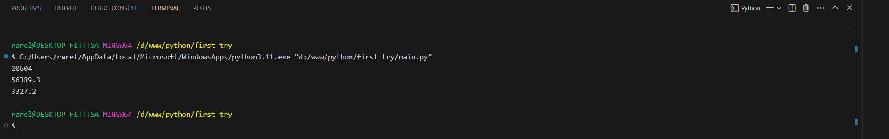
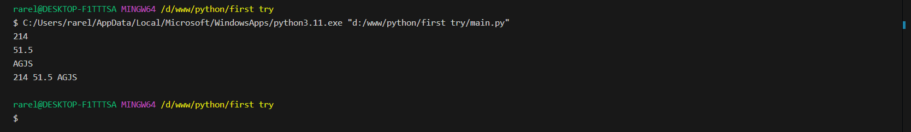

# Тема 2. Базовые операции языка Python
Отчет по Теме #2 выполнил(а):
- Сельков Вадим Андреевич
- АИС-22-1

| Задание | Лаб_раб | Сам_раб |
| ------ | ------ | ------ |
| Задание 1 | + | + |
| Задание 2 | + | + |
| Задание 3 | + | + |
| Задание 4 | + | + |
| Задание 5 | + | + |
| Задание 6 | + | + |
| Задание 7 | + | + |
| Задание 8 | + | + |
| Задание 9 | + | + |
| Задание 10 | + | + |

знак "+" - задание выполнено; знак "-" - задание не выполнено;

Работу проверили:
- к.э.н., доцент Панов М.А.

## Лабораторная работа №1
### Выведите в консоль три строки. Первая – любое число. Вторая – любое число в виде строки. Третья – любое число с плавающей точкой.

```python
print(123)
print('123')
print(1.23)
```
### Результат.


## Лабораторная работа №2
### Выведите в консоль три строки. Первая - результат сложения или вычитания миниум двух переменных типа int. Втораяя - результат сложения или вычитания минимум двух переменных типа float. Третья - результат сложения или вычитания минимум двух переменных типа int и float

```python
print (21848 - 1244)
print (32194.4 + 24194.9)
print (3391 - 682.5 + 912 - 293.3)
```
### Результат.




## Лабораторная работа №3
### Выведите в консоль три строки. Первая - обычная строка. Вторая - F строка с использованием заранее объявленной переменной. Третья - сложите две или более строк в одну.

```python
print ('Hello world')

name = 'Петя'
print(f'Привет, {name}!')

word1 = 'str'
word2 = 'str'

print(word1 + word2)
```
### Результат.


## Лабораторная работа №4
### Выведите в консоль три строки. Первая - трансформация любого типа переменной в bool. Вторая - трансформация любого типа переменной в float или int. Третья - трансформация любого типа переменной в str.

```python
x = 15
print(bool(x))

y = 214
print(float(y))

z = 2941.4
print(str(z))

```
### Результат.


## Лабораторная работа №5
### Присвойте трем переменным различные значения, воспользовавшись функцией input()

```python
x = int(input())
y = float(input())
z = str(input())

print(x,y,z)

```
### Результат.




## Лабораторная работа №6
### Создайте две любые числовые переменные и выполните над ними несколько математических операций: возведение в степень, обычное деление, целочисленное деление, нахождение остатка от деления.  

```python
x = 31
y = 5
print(x**y)
print(x / y)
print(x // y)
print(x % y)
```
### Результат.


## Лабораторная работа №7
### Создайте любую строковую переменную и произведите над ней математическое действие: умножение на любое число.

```python
x = 'asf'
print(x*10)
```
### Результат.


## Лабораторная работа №8
### Посчитать сколько раз символ 'o' встречается в строке 'Hello World' 

```python
x = 'Hello World' 
print(x.count('o'))
```
### Результат.


## Лабораторная работа №9
### Напишите предложение 'Hello World' в две строки. Написанная программа должна занимать одну строку в редакторе кода. 

```python
print('Hello \nWorld')
```
### Результат.


## Лабораторная работа №10
### Из предложения 'Hello World' выведите в консоль только 2 символ, а затем выведите слово 'Hello' 

```python
x = 'Hello World'
print(x[1])
print(x[:5])

```
### Результат.


## Самостоятельная работа №1
### Выведите в коноль булевую переменную False, не используя слово False в строке или изначально присвоенную булевую переменную. Программа должна занимать не более двух строк редактора кода.

```python

x = 10 
print(x < 0)

```

### Результат.


## Вывод

В этом задании я научился использовать булевые значения, а также использовать их в программе.

## Самостоятельная работа №2
### Присвоить значения трем переменным и вывести их в консоль, используя только две строки редактора кода.

```python

a, b, c = 10, 20, 30
print(a, b, c)

```

### Результат.


## Вывод

Это задание было не сложным, и я доказал себе, что знаю, что можно присваивать несколько переменных одновременно.

## Самостоятельная работа №3
### Реализуйте ввод данных в программу, через консоль, в виде только целых чисел(тип данных int). То есть при вводе буквенных символов в консоль, программа не должна работать.
Программа должна занимать не более двух строк редактора кода.

```python

print(int(input()))

```

### Результат.


## Вывод

Я знал, но убедился, что int отвечает за ввод только чисел.

## Самостоятельная работа №4
### Создайте только одну строковую переменную. Длина строки должна не превышать 5 символов. На выходе мы должны получить строку длиной не менее 16 символов. Программа должна занимать не более двух строк редактора кода.

```python

x = 'haha'
print(x*5)

```

### Результат.


## Вывод

Благодаря этому заданию я научился использовать повторяющиеся строки с помощью операции умножения.

## Самостоятельная работа №5
### Создайте три переменные: день (тип данных - числовой), месяц (тип данных - строка), год (тип данных - числовой) и выведите в консоль текущую дату в формате: "Сегодня день месяц год. Всего хорошего!" используя F строку и оператор end внутри print(), в котором вы должны написать фразу "Всего хорошего". Программа должна занимать не более двух строк редактора кода. 

```python

day = 16; month = 'Сентябрь'; year = 2024
print(f"Сегодня {day} {month} {year}", end=' Всего хорошего!')

```

### Результат.


## Вывод

В этом задании я научился использовать форматированные строки.

## Самостоятельная работа №6
### В предложении 'Hello World' вставьте 'my' между двумя словами. Выведите полученное предложение в консоль в одну строку. Программа должна занимать не болле двух строк редактора кода.

```python

x =  'my'
print(f"Hello {x} World")

```

### Результат.


## Вывод

Благодаря предыдущему заданию я догадался, что можно использовать форматированные строки для вставки слов.

## Самостоятельная работа №7
### Узнайте длину предложения 'Hello Wolrd', результат выведите в консоль. Программа должна занимать не более двух строк редактора кода. 

```python

print (len('Hello World'))

```

### Результат.


## Вывод

В этом задании я вспомнил о функции len.

## Самостоятельная работа №8
### Переведите предложение 'HELLO WORLD' в нижний регистр. Программа должна занимать не более двух строк редактора кода.

```python

print(str.lower('HELLO WORLD'))

```

### Результат.


## Вывод

В этом задании я научился использовать функцию str.lower. До этого использовал только str.upper почему-то...

## Самостоятельная работа №9
### Самостоятельно придумайте задачу по проходимой теме и решите её. Задача должна быть связана со взаимодействием с числовыми значениями. 

-Создайте программу, которая принимает на вход три числа, объединяет их в одно число (например, из чисел 3,5, и 7 получается число 357), и выводит в консоль. Программа должна занимать не более двух строк редактора кода. 

```python

x, y, z = int(input()), int(input()), int(input()) 
print(str(x) + str(y) + str(z))

```

### Результат.


## Вывод

Здесь я сам придумал задачу, и, по-моему, придумал интересное решение, воспользовавшись знаниями из теории. 

## Самостоятельная работа №10
### Самостоятельно придумайте задачу по проходимой теме и решите её. Задача должна быть связана со взаимодействием со строковыми значениями. 

-Напишите программу, которая принимает строку, состоящую из слов, разделенных пробелами, и выводит эту строку в обратном порядке, но сами слова остаются на своих местах. Программа должна занимать не более двух строк кода. 

```python

x = 'Hello World'
print(x[::-1])

```

### Результат.


## Вывод

Эту программу я сгенерировал и в процессе решения узнал о функции срезов, которая позволяет выводить строки в обратном порядке.

## Общие выводы по теме

Эта тема была не очень сложной, но с интересными задачами. 

Я научился использовать булевые значения, форматированные строки, а также научился использовать функции len, str.lower и функция срезов, о которой узнад самостоятельно.

С помощью предоставленой теории и лабораторным заданиям я стал лучше понимать, как работать с базовыми типами данных.
