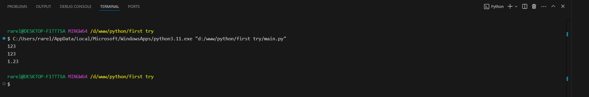
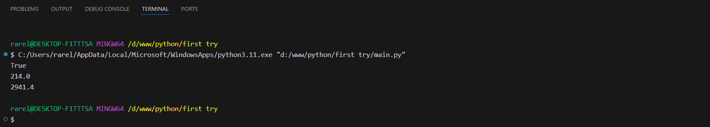
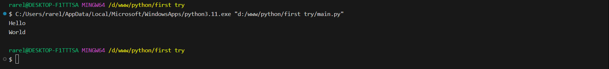

# Тема 2. Базовые операции языка Python
Отчет по Теме #2 выполнил(а):
- Сельков Вадим Андреевич
- АИС-22-1

| Задание | Лаб_раб | Сам_раб |
| ------ | ------ | ------ |
| Задание 1 | + | - |
| Задание 2 | + | - |
| Задание 3 | + | - |
| Задание 4 | + | - |
| Задание 5 | + | - |
| Задание 6 | + | - |
| Задание 7 | + | - |
| Задание 8 | + | - |
| Задание 9 | + | - |
| Задание 10 | + | - |

знак "+" - задание выполнено; знак "-" - задание не выполнено;

Работу проверили:
- к.э.н., доцент Панов М.А.

## Лабораторная работа №1
### Выведите в консоль три строки. Первая – любое число. Вторая – любое число в виде строки. Третья – любое число с плавающей точкой.

```python
print(123)
print('123')
print(1.23)
```
### Результат.



## Лабораторная работа №2
### Выведите в консоль три строки. Первая - результат сложения или вычитания миниум двух переменных типа int. Втораяя - результат сложения или вычитания минимум двух переменных типа float. Третья - результат сложения или вычитания минимум двух переменных типа int и float

```python
print (21848 - 1244)
print (32194.4 + 24194.9)
print (3391 - 682.5 + 912 - 293.3)
```
### Результат.


## Лабораторная работа №3
### Выведите в консоль три строки. Первая - обычная строка. Вторая - F строка с использованием заранее объявленной переменной. Третья - сложите две или более строк в одну.

```python
print ('Hello world')

name = 'Петя'
print(f'Привет, {name}!')

word1 = 'str'
word2 = 'str'

print(word1 + word2)
```
### Результат.


## Лабораторная работа №4
### Выведите в консоль три строки. Первая - трансформация любого типа переменной в bool. Вторая - трансформация любого типа переменной в float или int. Третья - трансформация любого типа переменной в str.

```python
x = 15
print(bool(x))

y = 214
print(float(y))

z = 2941.4
print(str(z))

```
### Результат.




## Лабораторная работа №5
### Присвойте трем переменным различные значения, воспользовавшись функцией input()

```python
x = int(input())
y = float(input())
z = str(input())

print(x,y,z)

```
### Результат.


## Лабораторная работа №6
### Создайте две любые числовые переменные и выполните над ними несколько математических операций: возведение в степень, обычное деление, целочисленное деление, нахождение остатка от деления.  

```python
x = 31
y = 5
print(x**y)
print(x / y)
print(x // y)
print(x % y)
```
### Результат.


## Лабораторная работа №7
### Создайте любую строковую переменную и произведите над ней математическое действие: умножение на любое число.

```python
x = 'asf'
print(x*10)
```
### Результат.


## Лабораторная работа №8
### Посчитать сколько раз символ 'o' встречается в строке 'Hello World' 

```python
x = 'Hello World' 
print(x.count('o'))
```
### Результат.


## Лабораторная работа №9
### Напишите предложение 'Hello World' в две строки. Написанная программа должна занимать одну строку в редакторе кода. 

```python
print('Hello \nWorld')
```
### Результат.




## Лабораторная работа №10
### Из предложения 'Hello World' выведите в консоль только 2 символ, а затем выведите слово 'Hello' 

```python
x = 'Hello World'
print(x[1])
print(x[:5])

```
### Результат.


## Самостоятельная работа №1
### Выведите в коноль булевую переменную False, не используя слово False в строке или изначально присвоенную булевую переменную. Программа должна занимать не более двух строк редактора кода.

```python

x = 10 
print(x < 0)

```

### Результат.


## Самостоятельная работа №2
### Присвоить значения трем переменным и вывести их в консоль, используя только две строки редактора кода.

```python

a = 10; b = 20; c = 30 
print(a, b, c)

```

### Результат.


## Вывод

## Самостоятельная работа №3
### Реализуйте ввод данных в программу, через консоль, в виде только целых чисел(тип данных int). То есть при вводе буквенных символов в консоль, программа не должна работать.
Программа должна занимать не более двух строк редактора кода.

```python

print(int(input()))

```

### Результат.


## Вывод

## Самостоятельная работа №4
### 

```python

```

### Результат.


## Вывод

## Самостоятельная работа №5
### 

```python

```

### Результат.


## Вывод

## Самостоятельная работа №6
### 

```python

```

### Результат.


## Вывод

## Самостоятельная работа №7
### 

```python

```

### Результат.


## Вывод

## Самостоятельная работа №8
### 

```python

```

### Результат.


## Вывод

## Самостоятельная работа №9
### 

```python

```

### Результат.


## Вывод

## Самостоятельная работа №10
### 

```python

```

### Результат.


## Вывод


## Общие выводы по теме
- Развернутый вывод
