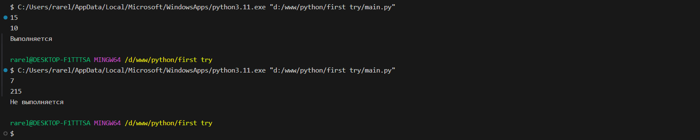
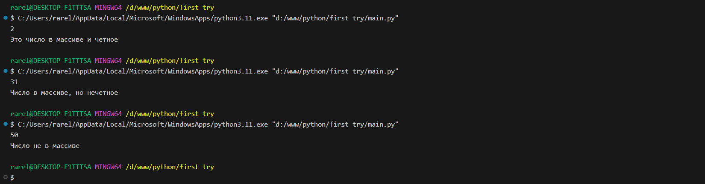

# Тема 3. Операторы, условия, циклы
Отчет по Теме #3 выполнил(а):
- Сельков Вадим Андреевич
- АИС-22-1

| Задание | Лаб_раб | Сам_раб |
| ------ | ------ | ------ |
| Задание 1 | + | + |
| Задание 2 | + | + |
| Задание 3 | + | + |
| Задание 4 | + | + |
| Задание 5 | + | + |
| Задание 6 | + | - |
| Задание 7 | + | - |
| Задание 8 | + | - |
| Задание 9 | + | - |
| Задание 10 | + | - |

знак "+" - задание выполнено; знак "-" - задание не выполнено;

Работу проверили:
- к.э.н., доцент Панов М.А.

## Лабораторная работа №1
### Создайте две переменные, значение которых будете вводить через консоль. Также составьте условие, в котором созданные ранее переменные будут сравниваться, если условие выполняется, то выведете в консоль "Выполняется", если нет, то "Не выполняется. 

```python

a = int(input())
b = int(input())

if a > b:
    print('Выполняется')
else:
    print('Не выполняется')


```
### Результат.



## Лабораторная работа №2
### Напишите программу, которая будет определять значения переменной меньше 0, больше 0 и меньше 10 или больше 10. Это нужно реализовать при помощи одной переменной, значение которой вводится через консоль, а также при помощи конструкций if, elif, else.

```python

x = int(input())

if x < 0:
    print('Число меньше 0')
elif x == 0:
    print('Число равно 0')
elif 0 < x < 10:
    print('Число больше 0, но меньше 10')
elif x == 10:
    print('Число равно 10')
else:
    print('Число больше 10')

```
### Результат.


## Лабораторная работа №3
### Напишите программу, в которой будет проверяться есть ли переменная в указанном массиве используя логичекий оператор in. Самостоятельно посмотрите, как работает программа со значениями, которых нет в массиве numbers.

```python

numbers = [1, 22, 53, 14]
number = int(input())

if number in numbers:
    print('Число есть в массиве!')
else:
    print('Числа нет в массиве...')

```
### Результат.


## Лабораторная работа №4
### Напишите программу, которая будет определять находится ли переменная в указанном массиве и если да, то проверьте четная она или нет. Самостоятельно протестируйте данную программу с разными значениями input. 

```python

numbers = [2, 31, 65, 95, 210]

x = int(input())
if x in numbers:
    if x % 2 == 0:
        print('Это число в массиве и четное')
    else:
        print('Число в массиве, но нечетное')
else:
    print('Число не в массиве')


```
### Результат.



## Лабораторная работа №5
### Напишите программу, в которой циклом for значения переменной i будут меняться от 0 до 10 и посмотрите, как разные виды сравнений и операций работают в цикле. 

```python

for i in range (10):
    print('i= ', i)
    if i == 0:
        i += 2
    if i == 1:
        continue
    if i == 2 or i == 3:
        print('Число равно 2 или 3')
    elif i in [4, 5, 6]:
        continue
    elif i in [7, 8, 9]:
        print('Переменная 7, 8 или 9')
    else:
        break


```
### Результат.


## Лабораторная работа №6
### Напишите программу, в которой при помощи цикла for определяется есть ли переменная letter в строке string и посмотрите, как работает оператор else для циклов. Самостоятельно посмотрите, что выведет программа, если значение переменной letter оказалось в строке string.

Определить индекс букв можно благодаря: 
index - string.find(letter)

```python

string = 'Hello World'
letter = input()
for i in string:
    if i == letter:
        index = string.find(letter)
        print(f"Буква <{str.upper(letter)}> встречается в строке под индексом {index}")
        break
else:
   print(f"Буква {letter} не встречается в строке")

```
### Результат.


## Лабораторная работа №7
### Напишите программу, в которой вы наглядно посмотрите, как работает цикл for проходя в обратном порядке, то есть, к примеру не от 0 до 10, а от 10 до 0. 

```python

string = 'До запуска ракеты осталось: '
for i in range(10, -1, -1):
  print(string, i)

```
### Результат.


## Лабораторная работа №8
### Напишите программу используя цикл while, внутри которого есть какие-либо проверки, но быть осторожным, поскольку циклы while при неправильно написанных условиях могут становится бесконечными, как указано в примере далее. 

```python
x = 10 

while x > 0:
  x -= 1
  if x % 2 == 0:
    print(x, '-число четное')
  else: 
    print(x , '-число нечетное')


```
### Результат.


## Лабораторная работа №9
### 

```python

for i in range(3):
    for j in range(3):
        if i == j:
            print(i, j, 'Совпадение')
        else: 
            print(i, j, 'Числа разные')
      


```
### Результат.


## Лабораторная работа №10
### 

```python


```
### Результат.


## Самостоятельная работа №1
### 

```python


```

### Результат.


## Вывод


## Самостоятельная работа №2
### 

```python


```

### Результат.


## Вывод


## Самостоятельная работа №3
### 

```python


```

### Результат.


## Вывод


## Самостоятельная работа №4
### 

```python


```

### Результат.


## Вывод


## Самостоятельная работа №5
### 

```python


```

### Результат.


## Вывод


## Общие выводы по теме


