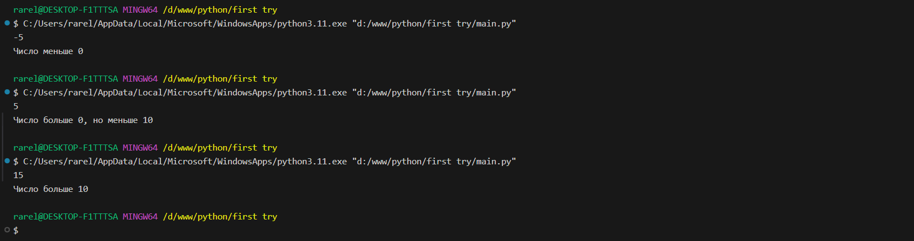

# Тема 3. Операторы, условия, циклы
Отчет по Теме #3 выполнил(а):
- Сельков Вадим Андреевич
- АИС-22-1

| Задание | Лаб_раб | Сам_раб |
| ------ | ------ | ------ |
| Задание 1 | + | + |
| Задание 2 | + | + |
| Задание 3 | + | + |
| Задание 4 | + | + |
| Задание 5 | + | + |
| Задание 6 | + | - |
| Задание 7 | + | - |
| Задание 8 | + | - |
| Задание 9 | + | - |
| Задание 10 | + | - |

знак "+" - задание выполнено; знак "-" - задание не выполнено;

Работу проверили:
- к.э.н., доцент Панов М.А.

## Лабораторная работа №1
### Создайте две переменные, значение которых будете вводить через консоль. Также составьте условие, в котором созданные ранее переменные будут сравниваться, если условие выполняется, то выведете в консоль "Выполняется", если нет, то "Не выполняется. 

```python

a = int(input())
b = int(input())

if a > b:
    print('Выполняется')
else:
    print('Не выполняется')


```
### Результат.


## Лабораторная работа №2
### Напишите программу, которая будет определять значения переменной меньше 0, больше 0 и меньше 10 или больше 10. Это нужно реализовать при помощи одной переменной, значение которой вводится через консоль, а также при помощи конструкций if, elif, else.

```python

x = int(input())

if x < 0:
    print('Число меньше 0')
elif x == 0:
    print('Число равно 0')
elif 0 < x < 10:
    print('Число больше 0, но меньше 10')
elif x == 10:
    print('Число равно 10')
else:
    print('Число больше 10')

```
### Результат.



## Лабораторная работа №3
### Напишите программу, в которой будет проверяться есть ли переменная в указанном массиве используя логичекий оператор in. Самостоятельно посмотрите, как работает программа со значениями, которых нет в массиве numbers.

```python

numbers = [1, 22, 53, 14]
number = int(input())

if number in numbers:
    print('Число есть в массиве!')
else:
    print('Числа нет в массиве...')

```
### Результат.


## Лабораторная работа №4
### Напишите программу, которая будет определять находится ли переменная в указанном массиве и если да, то проверьте четная она или нет. Самостоятельно протестируйте данную программу с разными значениями input. 

```python

numbers = [2, 31, 65, 95, 210]

x = int(input())
if x in numbers:
    if x % 2 == 0:
        print('Это число в массиве и четное')
    else:
        print('Число в массиве, но нечетное')
else:
    print('Число не в массиве')


```
### Результат.


## Лабораторная работа №5
### Напишите программу, в которой циклом for значения переменной i будут меняться от 0 до 10 и посмотрите, как разные виды сравнений и операций работают в цикле. 

```python

for i in range (10):
    print('i= ', i)
    if i == 0:
        i += 2
    if i == 1:
        continue
    if i == 2 or i == 3:
        print('Число равно 2 или 3')
    elif i in [4, 5, 6]:
        continue
    elif i in [7, 8, 9]:
        print('Переменная 7, 8 или 9')
    else:
        break


```
### Результат.


## Лабораторная работа №6
### Напишите программу, в которой при помощи цикла for определяется есть ли переменная letter в строке string и посмотрите, как работает оператор else для циклов. Самостоятельно посмотрите, что выведет программа, если значение переменной letter оказалось в строке string.

Определить индекс букв можно благодаря: 
index - string.find(letter)

```python

string = 'Hello World'
letter = input()
for i in string:
    if i == letter:
        index = string.find(letter)
        print(f"Буква <{str.upper(letter)}> встречается в строке под индексом {index}")
        break
else:
   print(f"Буква {letter} не встречается в строке")

```
### Результат.


## Лабораторная работа №7
### Напишите программу, в которой вы наглядно посмотрите, как работает цикл for проходя в обратном порядке, то есть, к примеру не от 0 до 10, а от 10 до 0. 

```python

string = 'До запуска ракеты осталось: '
for i in range(10, -1, -1):
  print(string, i)

```
### Результат.


## Лабораторная работа №8
### Напишите программу используя цикл while, внутри которого есть какие-либо проверки, но быть осторожным, поскольку циклы while при неправильно написанных условиях могут становится бесконечными, как указано в примере далее. 

```python
x = 10 

while x > 0:
  x -= 1
  if x % 2 == 0:
    print(x, '-число четное')
  else: 
    print(x , '-число нечетное')


```
### Результат.


## Лабораторная работа №9
### Напишите программу с использованием вложенных циклов и одной проверкой внутри них. Самое главное, не забудьте, что нельзя использовать одинаковые имена итерируемых переменных, когда вы используете вложенные циклы.

```python

for i in range(3):
    for j in range(3):
        if i == j:
            print(i, j, 'Совпадение')
        else: 
            print(i, j, 'Числа разные')
      


```
### Результат.


## Лабораторная работа №10
### Напишите программу с использованием flag, которое будет определять есть ли нечетное число в массиве. В одной задаче flag выступает в роли индиктора встречи нечетного числа в исходном массиве, четных чисел. 

```python

flag = False 

N = [2, 4, 6, 9, 10]

for i in N:
  if i % 2 == 0:
    Flag = False
    print('Число чётное')
  else: 
    Flag = True 
    print(Flag, 'Число нечётное')
    break


```
### Результат.


## Самостоятельная работа №1
### Напишите программу, которая преобразует 1 в 31. 
Для выполнения поставленной задачи необходимо обязательно и только один раз использовать: 

* Цикл for
* *= 5
* += 1

Никаких других действий или циклов использовать нельзя

```python

x = 1 

for i in range(2):
  x *= 5
  x += 1

print(x)

```

### Результат.


## Вывод

Эта программа интересна, скорее, с логической точки зрения. Также проверяет умение работать с циклом for. 

## Самостоятельная работа №2
### Напишите программу, которая фразу "Hello World" выводит в обратном порядке, и каждая буква находится в одной строке консоли. Программа должна занимать не более 3 строк в редакторе кода

```python

for i in ('Hello World'[::-1]):
    print(i)


```

### Результат.


## Вывод

Подобное задание я придумывал в прошлой теме в домашнем задании. Поэтому я был знаком с функцией [::-1]. Но интересен сам пробег по циклу for.

## Самостоятельная работа №3
### Напишите программу, на вход которой поступает значение из консоли, оно должно быть числовым и в диапазоне от 0 до 10 включительно. Если вводимое число не подходит по требованиям, то необходимо вывести оповещение об этом в консоль и остановить программу. Код должен вычислять в каком диапазоне находится полученное число.

```python

x = int(input())
if x < 0 or x > 10:
  print('Введеное число не подходит')
  break
else:
  if 0 <= x <= 3: 
    print('Число находится в диапазоне от 0 до 3')
  elif 3 < x < 6:
    print('Число находится в диапазоне от 3 до 6')
  else:
    print('Число находится в диапазоне от 6 до 10')


```

### Результат.


## Вывод

Программа интересна тем, что она проверяет ввод пользователя на соответствие требованиям.

## Самостоятельная работа №4
### Манипулирование строками. Напишите программу на Python, которая принимает предложение (на английском) в качестве входных данных от пользователя. При этом выполняются некоторые условия. 

```python

x = input()
y = str.lower(x)
list = y.split()

print(len(x))

print(y)

print('a =', y.count('a'), 'e =', y.count('e'), 'i =', y.count('i'), 'o =', y.count('o'), 'u =', y.count('u'))

print(x.replace('ugly','beauty'))

if list[0] == 'the' or list[-1] == 'end':
  print('Предложение начинается на <The> или оканчивается на <end>')
else: 
  print('В предложении нет <The> или <end>')

```

### Результат.


## Вывод

Багодаря этой программе я научился проверять последнее слово в предложении с помощью списка. Также вспомнил о replace команде.

## Самостоятельная работа №5
### Составьте программу, результатом которой будет данный вывод в консоль:

* hello world
* hello

```python

counter = 0
string = 'hello'
memory = ' world'

while counter != 11:
    if counter % 2 == 0:  
        print(string + memory)
    else:  
        print(string)
    counter += 1


```

### Результат.


## Вывод

В этой программе я проверил себя в качестве сборщика предложенного кода. И повторил функцию while.

## Общие выводы по теме

Благодаря этой теме я повторил работу с циклами, а также с функциями.

Прошёл интересные логические и, как мне кажется, эксперементальные задачи 

Функции, которые я использовал безусловно помогут мне создать более сложные программы с более интересным решением.

Я стал увереннее в своих силах.


