# Тема 4. Функции и стандартные модули/библиотеки
Отчет по Теме #4 выполнил(а):
- Сельков Вадим Андреевич
- АИС-22-1

| Задание | Лаб_раб | Сам_раб |
| ------ | ------ | ------ |
| Задание 1 | + | + |
| Задание 2 | + | + |
| Задание 3 | + | + |
| Задание 4 | + | + |
| Задание 5 | + | + |
| Задание 6 | + | - |
| Задание 7 | + | - |
| Задание 8 | + | - |
| Задание 9 | + | - |
| Задание 10 | + | - |

знак "+" - задание выполнено; знак "-" - задание не выполнено;

Работу проверили:
- к.э.н., доцент Панов М.А.

## Лабораторная работа №1
### Напишите функцию, которая выполняет любые арифметические действия и выводит результат в консоль. Вызовите функцию, используя "точку входа"

```python

def main():
  print(5+10)


if __name__ == "__main__":
  main()


```
### Результат.
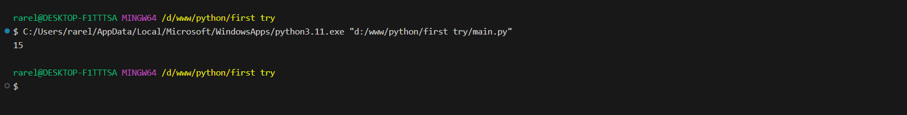


## Лабораторная работа №2
### Напишите функцию, которая выполняет любые арифметические действия, возвращает при помощи return значение в место, откуда вызывали функцию. Выведите результат в консоль. Вызовите функцию, используя "точку входа".

```python

def main():
  return 12+43


if __name__ == "__main__":
  print(main())


```
### Результат.
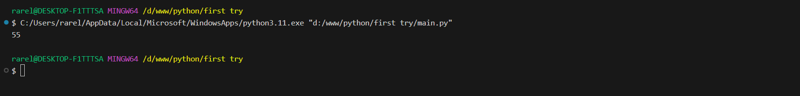


## Лабораторная работа №3
### Напишите функцию, в которую передаются два аргумента, над ними производится арифметическое действие, результат возвращается туда, откуда эту функцию вызывали. Выведите результат в консоль. Вызовите функцию в любом небольшом цикле.

```python

def main(x,y):
  return x + y

count = 0
for i in range(3):
  if main(int(input()),int(input())) % 2 == 0:
    count += 1
    print(i, 'Чётная сумма')
  else:
    print(i, 'сумма нечётная')
  

print('\nЧетных пар: ', count)

```
### Результат.
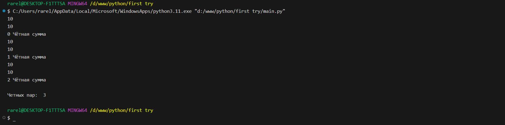


## Лабораторная работа №4
### Напишите функцию, на вход которой подается какое-то изначальное неизвестное количество аргументов, на которыми будет производится арифметические действия. Для выполнения задания необходимо использовать кортеж "*args".

```python

def main(x, *args):
  first = x 
  second = sum(args)
  third = len(args)
  print(f'first = {first}\nsecond = {second}\nthird = {third}')

  return x * sum(args) + len(args)


if __name__ == '__main__':
  result = main(10, 20, 30, 40, 50)
  print(result)

```
### Результат.
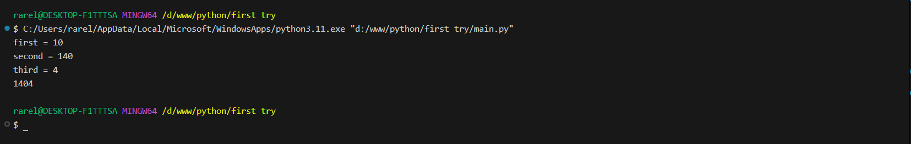


## Лабораторная работа №5
### Напишите ффункцию, которая на вход получает кортеж "**kwargs" и при помощи цикла выводит зачения, поступившие в функцию. 

```python

def main(**kwargs):
  for key in kwargs:
    print(f"{key}: {kwargs[key]}")


if __name__ == "__main__":
  main(x=1, y=2, z=3)

```
### Результат.
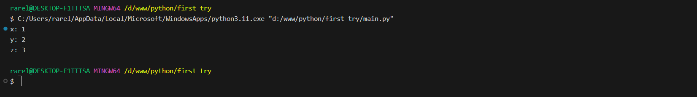


## Лабораторная работа №6
### Напишите две функции. Первая - получает в виде параметра "**kwargs". Вторая считает среднее арифметическое из значений первой функции. Вызовите первую функцию используя "точку входа" и минимум 4 аргумента.

```python

def main(**kwargs):
  for i, j in kwargs.items():
    print(f"{i}. Average = {avg(j)}")

def avg(data):
  return sum(data) / len(data)


if __name__ == "__main__":
  main(first = [1,2,3,4], second=[1,2,3,4,5,6,7,8,9,10])

```
### Результат.
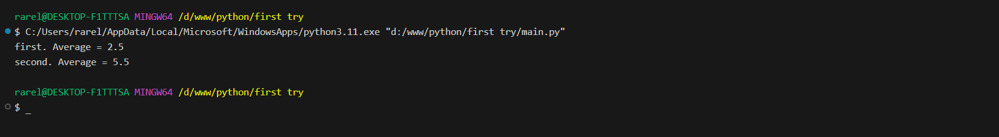


## Лабораторная работа №7
### Создайте дополнительный файл .py. Напишите в нем любую функцию, которая будет что угодно выводить в консоль, но не вызывайте её в нём. Откройте файл main.py импортируйте в него функцию из нового файла и при помощи "точки входа" вызовите эту функцию.

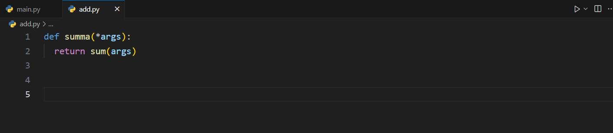
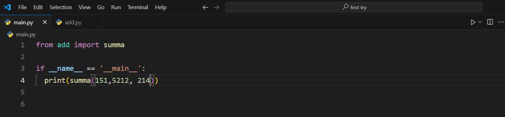

```python

# модуль

def summa(*args):
  return sum(args)

# main
from add import summa 

if __name__ == '__main__':
  print(summa(151,5212, 214))


```
### Результат.
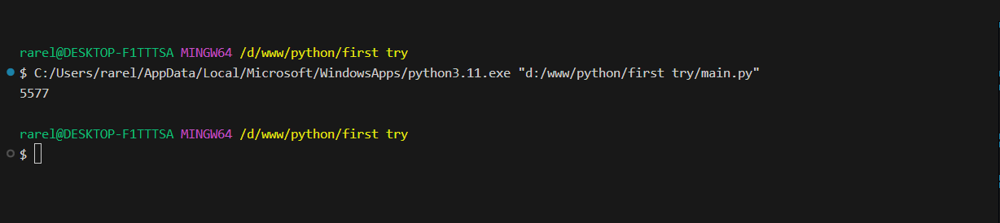


## Лабораторная работа №8
### Напишите программу, которая будет выводить корень, синус, косинус полученного от пользователя числа.

```python

from math import sqrt, sin , cos


def main():
  x = int(input("Введите число: "))
  print(f'Корень числа: {sqrt(x)}')
  print(f'Синус числа: {sin(x)}')
  print(f'Косинус числа: {cos(x)}')

if __name__ == '__main__':
  main()


```
### Результат.
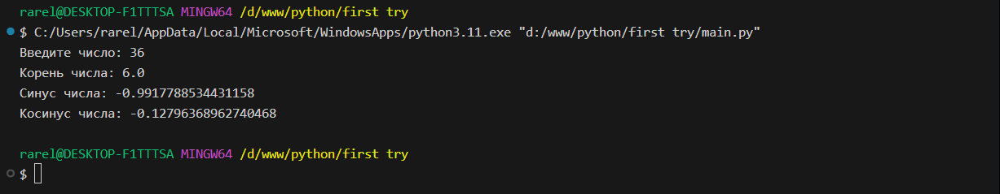


## Лабораторная работа №9
### Напишите программу, которая будет рассчитывать какой день недели будет через n-нное количество дней, которые укажет пользователь 

```python

from datetime import datetime
from datetime import timedelta

def main():
  print(
    f"Сегодня {datetime.today().day}"
    f"\nДень недели - {datetime.today().isoweekday()}"
    )

n = int(input("Введите количество дней: "))

today = datetime.today()
result = today + timedelta(days=n)

print(
  f"Через {n} дней будет {result.date().day}"
  f"\nДень недели - {result.isoweekday()}"
)

if __name__ == '__main__':
  main()


```
### Результат.
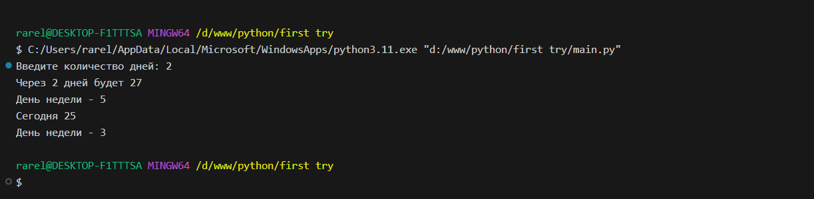


## Лабораторная работа №10
### Напишите программу с использованием глобальных переменных, которая будет считать площадь треугольника или прямоугольника в зависимости от того, что выберет пользователь

```python

from math import sqrt

global result

def rectangle():
  global result
  a = float(input("Введите длину: "))
  b = float(input("Введите ширину: "))
  result = a*b
  return result

def trianlge():
  global result
  a = float(input("Введите сторону: "))
  b = float(input("Введите сторону: "))
  c = float(input("Введите сторону: "))
  p = a+b+c // 2
  result = sqrt(p*(p-a)*(p-b)*(p-c))
  return result


decision = int(input("Прямоугольник - 1, Тругольник - 2: "))

if decision == 1:
    rectangle()
else: 
   trianlge()

print(f'Площадь фигуры: {result}')


```
### Результат.
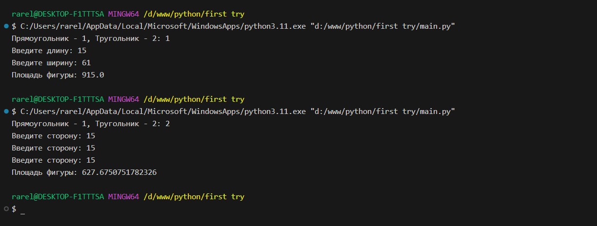


## Самостоятельная работа №1
### Дайте подробный комментарий для кода

```python

from datetime import datetime # Берёт параметр datetime из модуля datetime
from math import sqrt #Берёт параметр sqrt из модуля math

def main(**kwargs): # Функция main принимает параметры **kwargs

  '''
  С помощью цикла for проходим по всем элементам словаря kwargs.items()

  В переменной result записываем результат вычисления корня из суммы квадратов пары чисел

  Выводим на экран результат вычисления корня из суммы квадратов чисел
  '''

  for key in kwargs.items(): 
    result = sqrt(key[1][0] ** 2 + key[1][1] ** 2) 
    print(result)

if __name__ == '__main__': # Проверяем, что данный скрипт был запущен напрямую, а не импортирован как модуль
  start_time = datetime.now() # Записываем время начала выполнения программы
  main (
    one = [10, 3], 
    two = [5, 4],
    three = [15, 13],
    four = [93, 53],
    five = [133, 15],
  ) # Вызываем функцию main с определенными параметрами
  time_costs = datetime.now() - start_time # Вычисляем время выполнения программы
  print(f"Время выполнения программы - {time_costs}") # Выводим на экран время выполнения программы


```

### Результат.

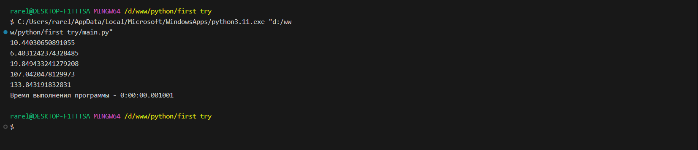

## Вывод

Закрепил понятие словаря **kwargs с его парами ключ-значение.

## Самостоятельная работа №2
### Напишите программу, которая будет заменять игральную кость с 6 гранями. Если значение равно 5 или 6, то в консоль выводится "Вы победили", если значения 3 или 4, то вы рекурсивно должны вызвать эту же функцию, если значение 1 или 2, то в консоль выводится "Вы проиграли". При этом каждый вызов функции необходимо выводить в косоль значение "кубика. Для Выполнения задания необходимо использовать стандартную библиотеку random. Программу нужно написать, используя одну функцию и "точку входа" 

```python

import random 

def game():
  cubic = random.randint(1,6)
  if cubic == 5 or cubic == 6:
    print(cubic, "Вы выиграли")
  elif cubic == 3 or cubic == 4:
    print(cubic, 'Ещё раз')
    game()
  else: 
    print(cubic, "Вы проиграли")

if __name__ == "__main__":
  game()


```

### Результат.

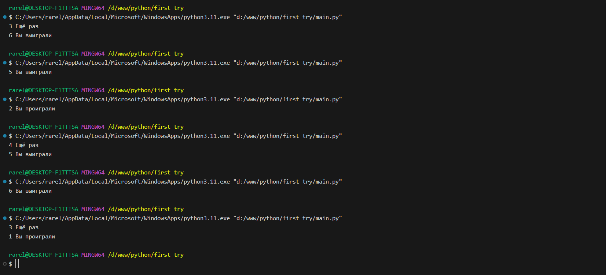

## Вывод
Благодаря этой задаче я наглядно понял пример использования рекурсивной функции и вызова "самого себя". Также узнал о модуле random.

## Самостоятельная работа №3
### Напишите программу, которая будет выводить текущее время, с точностью до секунд на протяжении 5 секунд. Программу нужно написать с использованием цила.

```python

import datetime 
import time

def main():
    for i in range (1):
      print(datetime.datetime.now().second)
      time.sleep(1)


if __name__ == "__main__":
   for i in range(5):
      main()


```

### Результат.

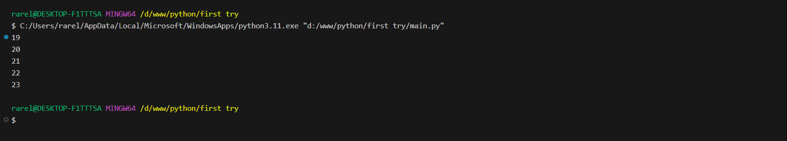

## Вывод
Решил интересное задание на логику, в котором пришлось подключать нестандартное мышление и парочку модулей: datetime и time с атрибутом sleep. 

## Самостоятельная работа №4
### Напишите программу, которая считает среднее арифметическое от аргументов вызываемой функции, с условием того, что изначальное колическое этих аргументов неизвестно. Программу необходимо реализовать используя одну функцию и "точку входа". 

```python

def avg (*args):
    return sum(args)/len(args)

if __name__ == "__main__":  
    print(int(avg(1,2,3,4,5)))

```

### Результат.

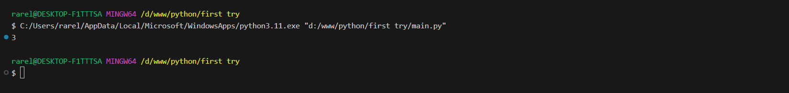

## Вывод
Благодаря этому заданию я закрепил параметр *args, который позволяет передавать неограниченное количество аргументов в функцию.

## Самостоятельная работа №5
### Создайте два Python файла, в одном будет выполняться вычисление площади треугольника при помощи формулы Герона (через функцию), а во втором будет происходить взаимодействие с пользователем (получение всей необходимой информации и вывод результатов). Напишите эту программу и выведите в консоль полученную площадь.

```python
# heron

from math import sqrt

def heron(a, b, c):
  p = a+b+c // 2
  return sqrt(p*(p-a)*(p-b)*(p-c))

# main

from heron import heron

a = int(input("Введите длину первой стороны: "))
b = int(input("Введите длину второй стороны: "))
c = int(input("Введите длину третьей стороны: "))

heron = heron(a, b, c)

if __name__ == "__main__":
  print(f"Площадь треугольника: {heron}")

```

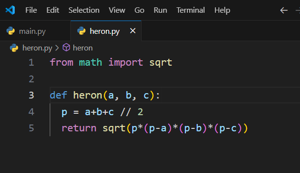
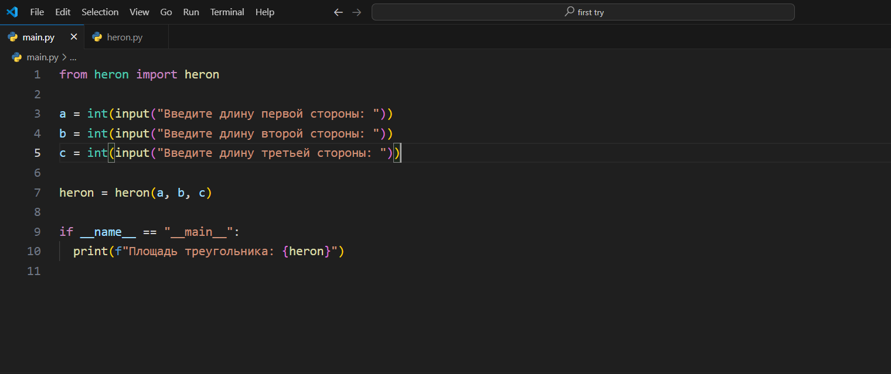

### Результат.

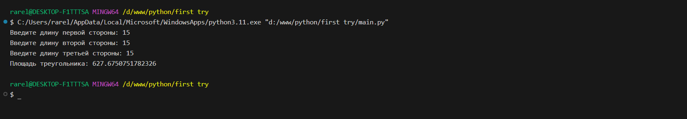

## Вывод

Это задание научило меня правильно использовать функцию, взятую из другого модуля, и применять на практике их взаимосвязь - когда один модуль выполняет свою фукнцию, а другой использует её.

## Общие выводы по теме

Благодаря данной теме я закрепил знания о функциях, их параметрах и их использовании. 

Узнал о новых модулях random, datetime, time и в принципе подключении кастомных модулей в свой main модуль.

Узнал о существовании **kwargs и *args, которые позволяют передавать неограниченное количество аргументов в функцию.


