# Тема 5. Базовые коллекции: строки и списки
Отчет по Теме #5 выполнил(а):
- Сельков Вадим Андреевич
- АИС-22-1

| Задание | Лаб_раб | Сам_раб |
| ------ | ------ | ------ |
| Задание 1 | + | + |
| Задание 2 | + | + |
| Задание 3 | + | + |
| Задание 4 | + | + |
| Задание 5 | + | + |
| Задание 6 | + | - |
| Задание 7 | + | - |
| Задание 8 | + | - |
| Задание 9 | + | - |
| Задание 10 | + | - |

знак "+" - задание выполнено; знак "-" - задание не выполнено;

Работу проверили:
- к.э.н., доцент Панов М.А.

## Лабораторная работа №1
### Друзья предложили вам поиграть в игру "найди отличия и убери повторения (версия для программистов)". Суть игры состоит в том, что на вход программы поступает два множества, а ваша задача вывести все элементы первого, которых нет во втором. 

```python

set_1 = {'Cat', 'Dog', 'Monkey', 'Elephant', 'Lion'}
set_2 = {'Dog', 'God', 'Smog', 'Smik'}
	
print(set_1 - set_2)


```
### Результат.
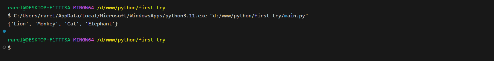


## Лабораторная работа №2
### Напишите две одинаковые программы, только одна бует использовать set(), а вторая frozenset() и попробуйте к исходному множеству добавить несколько элементов, например, через цикл. 

```python
set = {1, 2}

for i in range(len(set) + 1):
    if i - 2 == 0:
        set.add(6)
        print('set: ', set)
    else: 
        print('set: ', set)

frozenset = {1, 2}

for i in range(len(frozenset) + 1):
    if i - 2 == 0:
        set.add(6)
        print('frozenset: ',frozenset)
    else: 
        print('frozenset: ', frozenset)


```
### Результат.
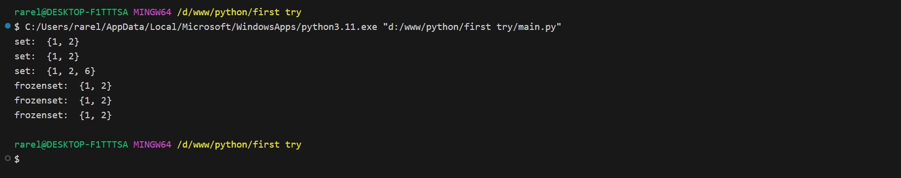


## Лабораторная работа №3
### На вход в программу поступает список (минимальной длинной 2 символа). Напиши программу, которая будет менять первый и последний элемент списка. 

```python

list = [1, 2, 3, 4, 5, 2, 4, 5]

list[0], list [-1] = list[-1], list[0]

print(list)

```
### Результат.
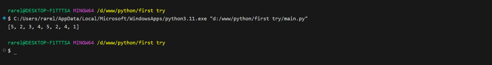


## Лабораторная работа №4
### На вход в программу поступает список (минимальной длиной 10 символов). Напишите программу, которая будет выводить элементы с индексами от 2 до 6. 

```python

my_list = list(range(1, 15))
print(my_list)
print(my_list[2:7])

```
### Результат.
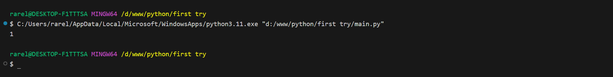


## Лабораторная работа №5
### Иван задумался о поиске "бесполезного" числа, полученного из списка. Суть поиска в следующем: он берет произвольный список чисел, находит самое большое из них, а затем делит его на длину списка. Студент пока не придумал, где может пригодиться подобное значение, но ищет у вас помощи в реализации такой функции useless().

```python

def useless (lst):
  return max(lst) // len(lst)


print(useless([1, 2, 3, 4, 5]))

```
### Результат.


## Лабораторная работа №6
### Ребята не могут определиться каким супергероям они хотят стать. У них есть случайно составленный список супергероев, и вы должны определить кто из ребят будет каким супергероем. Необходимо использовать разделение списков.

```python

superheroes = ['batman', 'wonderwomen', 'hulk']

vitaly, lera, petya = superheroes

print(f'Витя - {vitaly}, Лера - {lera}, Петя - {petya}')


```
### Результат.
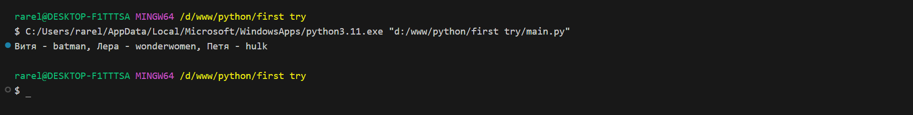


## Лабораторная работа №7
### Вовочка, насмотревшись передачи "Слабое звено" решил написать программу, которая также будет находить самое слабое звено (минимальный элемент) и удалять его, только делать он это хочет не с людьми, а со списком. Помогите Вовочке с реализацией программы.


```python

def weak(lst):
  x = min(lst)
  lst.remove(x)
  return lst

print(weak([215, 1239, 20, 210]))


```
### Результат.
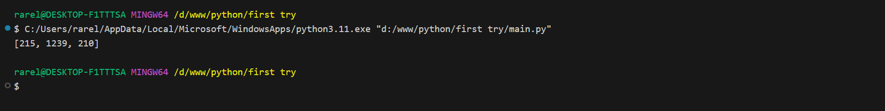


## Лабораторная работа №8
### Михаил решил создать большой n-мерный список, для этого он случайным образом создал несколько списков, состоящих минимум из 3, а максимум из 10 элементов и поместил их в один больщой список. Он также как и Иван не знает зачем ему это сейчас нужно, но надеется на то, что это пригодится ему в будущем.

```python

import random

def lists():
    list_of_numbers = [random.randint(0, 100) for i in range(3, 11)]
    return list_of_numbers


massive_list = []

for i in range(random.randint(1, 5)):
    massive_list.append(lists())

print(massive_list)


```
### Результат.
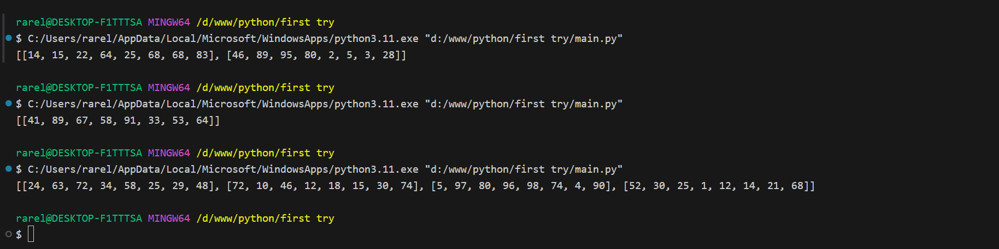


## Лабораторная работа №9
### Вы работаете в ресторане и отвечаете за статистику покупок, ваша задача сравнить между собой заказы покупателей, которые указаны в разном порядке. Реализуйте функцию superset(), которая принимает 2 множества. Результат работы функции: вывод в консоль одного из сообщений в зависимости от ситуации: 

```python

def superset(set_1, set_2):
  if set_1 > set_2:
    print(f'{set_1} - является супермножеством')
  elif set_1 == set_2:
    print(f'Множества равны')
  elif set_2 > set_1:
    print(f'{set_2} - является супермножеством')
  else: 
    print('Супермножества не обнаружено')

if __name__ == '__main__':
  superset({1, 8, 3, 5}, {3, 5})
  superset({3, 5}, {5, 3, 8, 1})
  superset({1, 8, 3, 5}, {5, 3, 8, 1})
  superset({90, 100}, {3, 5})


```
### Результат.
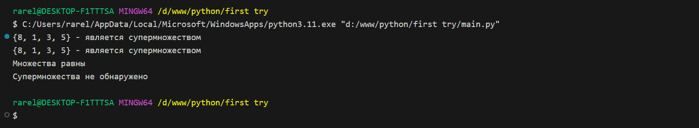


## Лабораторная работа №10
### Предположим, что вам нужно разобрать стопку бумаг, но нужно начать работу с нижней, "переверните стопку". Вам дан произвольный список. Представьте его в обратном порядке. Программа должна занимать не более двух строк в редакторе кода.

```python

list = [1, 5, 7, 8]
print(list[::-1])

```
### Результат.
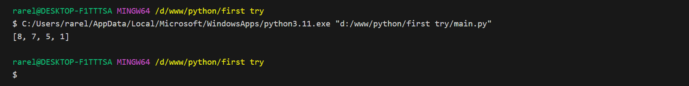


## Самостоятельная работа №1
### Ресторан на предприятии ведет учет посещений за неделю при помощи кода работника. У них есть список со всеми посещеиями за неделю. Ваша задача посчитать: 

- Сколько было выдано чеков
- Сколько разных людей посетило ресторан
- Какой работник посетил рестора больше всех раз

```python

list = [
  8734, 2345, 8201, 6621, 9999, 1234, 5678, 8201,
  8888, 4321, 3365, 1478, 9865, 5555, 7777, 9998, 
  1111, 2222, 3333, 4444, 5556, 6666, 5410, 7778,
  8889, 4445, 1439, 9604, 8201, 3365, 7502, 3016, 
  4928, 5837, 8201, 2643, 5017, 9682, 8530, 3250,
  7193, 9051, 4506, 1987, 3365, 5410, 7168, 7777,
  9865, 5678, 8201, 4445, 3016, 4506, 4506
]
unique = []
duplicates = []

for item in list: 
  if list.count(item) == 1:
    unique.append(item)
  if list.count(item) > 1:
    duplicates.append(item)

counter = {}

for i in duplicates: 
  if i not in counter:
    counter[i] = 0
  counter[i] += 1


print(f'Всего чеков было выдано: {len(list)}')
print(f'Разных людей посетило: {len(unique)}')
print(f'Больше всех ресторан посетил: <{max(counter, key=counter.get)}>, '
      f'он сделал это: {max(counter.values())} раз')

```

### Результат.

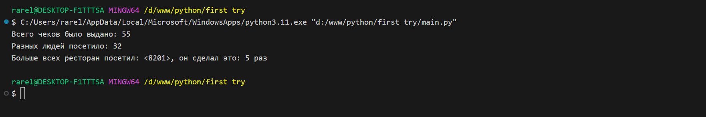

## Вывод


## Самостоятельная работа №2
### На физкультуре студенты сдавали бег, у преподавателя физкультуры есть список всех результатов, ему нужно узнать 

- Три лучших результата
- Три худших результата
- Все результаты начиная с 10
  

```python

list = [
  10.2, 14.8, 19.3, 22.7, 12.5, 33.1, 38.9, 21.6, 26.4,
  17.1, 30.2, 35.7, 16.9, 27.8, 24.5, 16.3, 18.7, 31.9,
  12.9, 37.4
]

list.sort()
list_more_than_10 = []

for i in list:
  if i > 10:
    list_more_than_10.append(i)


print(list[0:3])
print(list[-3:])
print(list_more_than_10)

```

### Результат.

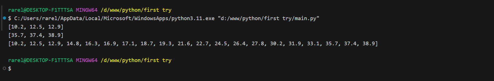

## Вывод


## Самостоятельная работа №3
### Преподаватель по математике придумал странную задачку. У вас есть три списка с элементами, каждый элемент которых - длина стороны треугольника, ваша задача найти площади двух треугольников, составленные из максимальных и минимальных элементов полученных списков. 

```python

from math import sqrt

def square_triangle(a, b, c):
  p = (a + b + c) / 2
  heron = sqrt(p * (p - a) * (p - b) * (p - c))
  return heron 
  
  
one = [12, 25, 3, 48, 71]
two = [5, 18, 40, 62, 98]
three = [4, 21, 37, 56, 84]

a, b, c = min(one), min(two), min(three)  

print(square_triangle(a, b, c))


```

### Результат.

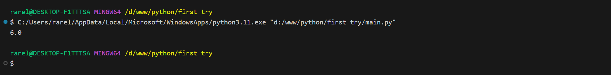

## Вывод


## Самостоятельная работа №4
### Никто не любит получать плохие оценки, поэтому Борис решил это исправить. Допустим, что все оценки студента за семестр хранятся в одном списке. Ваша задача удалить из этого списка все двойки, а все тройки заменить на четверки.

```python

list = [2, 3, 4, 5, 3, 4, 5, 2, 2, 5, 3, 4, 3, 5, 4]

for i in list:
  if 2 in list:
    list.remove(2)

for index in range(len(list)): 
  if list[index] == 3:
    list[index] = 4

print(list)

```

### Результат.

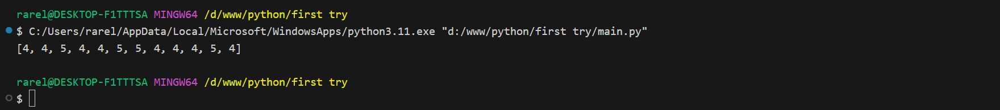

## Вывод


## Самостоятельная работа №5
### Вам предоставлены списки натуральных чисел, из них необходимо сформировать множества. При этом следует соблюдать это правило: если какие-либо число повторяется, то преобразовать его в строку по следующему образцу: например, если число 4 повторяется 3 раза, то в множестве будет следующая запись: само число 4, строка "44", строка "444".

```python


```


### Результат.

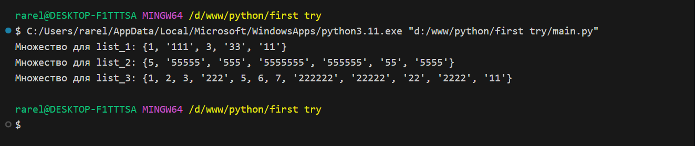

## Вывод


## Общие выводы по теме


