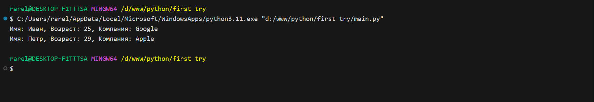
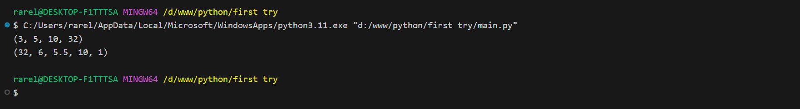
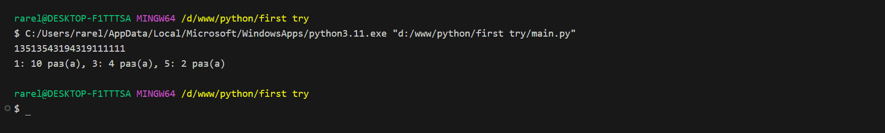

# Тема 6. Базовые коллекции: словари, кортежи
Отчет по Теме #6 выполнил(а):
- Сельков Вадим Андреевич
- АИС-22-1

| Задание | Лаб_раб | Сам_раб |
| ------ | ------ | ------ |
| Задание 1 | + | + |
| Задание 2 | + | + |
| Задание 3 | + | + |
| Задание 4 | + | + |
| Задание 5 | + | + |
| Задание 6 | - | - |
| Задание 7 | - | - |
| Задание 8 | - | - |
| Задание 9 | - | - |
| Задание 10 | - | - |

знак "+" - задание выполнено; знак "-" - задание не выполнено;

Работу проверили:
- к.э.н., доцент Панов М.А.

## Лабораторная работа №1
### В школе, где вы учились, узнали, что вы крутой программист и попросили написать программу для учителей, которая будет при вводе кабинета писать для него ключ доступа и статус, занят кабинет или нет. 

```python

request = int(input('Введите номер кабинета: '))

dictionary = {
  1: {'key': 101, 'access': True},
  2: {'key': 102, 'access': True},
  3: {'key': 103, 'access': True},
  4: {'key': 104, 'access': False},
  None: {'key': None, 'access': False}
}

response = dictionary.get(request)

if not response: 
  response = dictionary[None]

key = response['key']
access = response ['access']
print(f'Ключ: {key}, доступ: {access}')


```
### Результат.


## Лабораторная работа №2
### Алексей придумал создать самый большой словарь в мире. Для этого он придумал функцию dict_maker(**kwargs), которая принимает неограниченное количество параметров "ключ:значение" и обновляет созданный им словарь my_dict, состоящий всего из одного элемента "first" со значением "so easy". Помогите Алесею создать данную функцию. 

```python

my_dict = {'first': 'so easy'}

def dict_maker(**kwargs):
  my_dict.update(**kwargs)


dict_maker(a=1, b=2, c=3)
print(my_dict)

```
### Результат.


## Лабораторная работа №3
### Для решения некоторых задач необходимо разложить строку на отдельные символы. Мы знаем, что это можно сделать при помощи split(), у которого более гибкая настройка для разделения, но если нам нужно посимвольно разделить строку без всяких условий, то для этого нужно посимвольно разделить строку без всяких условий, то для этого мы можем использовать кортежи (tuple).

```python

x = 'Slovo'

list_of_letters = tuple(x)
print(list_of_letters)

```
### Результат.


## Лабораторная работа №4
### Вовочка решил написать крутую функцию, которая будет писать имя, возраст и место работы, но при этом на вход этой функции будет поступать кортеж. Помогите Вовочке написать эту программу. 

```python

def info(name, age, company):
  print(f'Имя: {name}, Возраст: {age}, Компания: {company}') 

info('Иван', 25, 'Google')
info('Петр', 29, 'Apple')


```
### Результат.



## Лабораторная работа №5
### Для сопровождения первых лиц государства X нужен кортеж, но никто не может определиться с порядком машин, поэтому вам нужно написать функцию, которая будет сортировать кортеж, состоящий из целых чисел по возрастанию, и возвращает его. Если хотя бы один элемент не является целым числом, то функция возвращает исходный кортеж.

```python

def tuple_sort(tpl):
  for elm in tpl:
    if not isinstance(elm, int):
      return tpl
  return tuple(sorted(tpl))

if __name__ == "__main__": 
  print(tuple_sort((32, 3, 5, 10)))
  print(tuple_sort((32, 6, 5.5, 10, 1)))


```
### Результат.



## Самостоятельная работа №1
### 

```python

x = input().split()
my_tuple = tuple(x)
print(f"Список = {x}\nКортеж = {my_tuple}")

```

### Результат.


## Вывод


## Самостоятельная работа №2
### 

```python

def remove_tumple():
    x = input().split()
    my_tuple = set(map(int,x))
    b = int(input())
    if b in my_tuple:
        my_tuple.remove(b)
        return tuple(my_tuple)
    else:
        return tuple(my_tuple)

print(remove_tumple())


```

### Результат.


## Вывод


## Самостоятельная работа №3
### 

```python


```

### Результат.



## Вывод


## Самостоятельная работа №4
### 

```python


```

### Результат.


## Вывод


## Самостоятельная работа №5
### 

```python


```


### Результат.


## Вывод


## Общие выводы по теме


