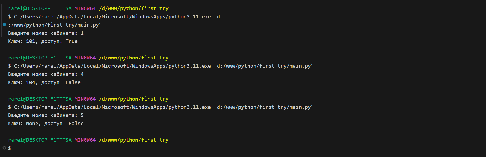
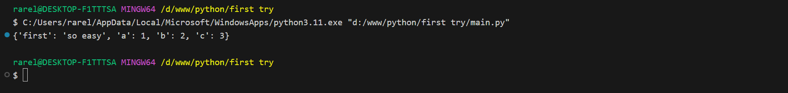
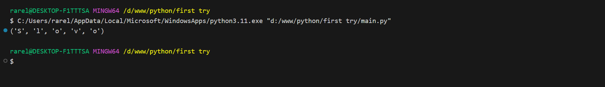
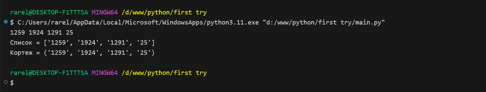

# Тема 6. Базовые коллекции: словари, кортежи
Отчет по Теме #6 выполнил(а):
- Сельков Вадим Андреевич
- АИС-22-1

| Задание | Лаб_раб | Сам_раб |
| ------ | ------ | ------ |
| Задание 1 | + | + |
| Задание 2 | + | + |
| Задание 3 | + | + |
| Задание 4 | + | + |
| Задание 5 | + | + |
| Задание 6 | - | - |
| Задание 7 | - | - |
| Задание 8 | - | - |
| Задание 9 | - | - |
| Задание 10 | - | - |

знак "+" - задание выполнено; знак "-" - задание не выполнено;

Работу проверили:
- к.э.н., доцент Панов М.А.

## Лабораторная работа №1
### В школе, где вы учились, узнали, что вы крутой программист и попросили написать программу для учителей, которая будет при вводе кабинета писать для него ключ доступа и статус, занят кабинет или нет. 

```python

request = int(input('Введите номер кабинета: '))

dictionary = {
  1: {'key': 101, 'access': True},
  2: {'key': 102, 'access': True},
  3: {'key': 103, 'access': True},
  4: {'key': 104, 'access': False},
  None: {'key': None, 'access': False}
}

response = dictionary.get(request)

if not response: 
  response = dictionary[None]

key = response['key']
access = response ['access']
print(f'Ключ: {key}, доступ: {access}')


```
### Результат.



## Лабораторная работа №2
### Алексей придумал создать самый большой словарь в мире. Для этого он придумал функцию dict_maker(**kwargs), которая принимает неограниченное количество параметров "ключ:значение" и обновляет созданный им словарь my_dict, состоящий всего из одного элемента "first" со значением "so easy". Помогите Алесею создать данную функцию. 

```python

my_dict = {'first': 'so easy'}

def dict_maker(**kwargs):
  my_dict.update(**kwargs)


dict_maker(a=1, b=2, c=3)
print(my_dict)

```
### Результат.



## Лабораторная работа №3
### 

```python


```
### Результат.



## Лабораторная работа №4
### 

```python


```
### Результат.


## Лабораторная работа №5
### 

```python


```
### Результат.


## Самостоятельная работа №1
### 

```python


```

### Результат.



## Вывод


## Самостоятельная работа №2
### 

```python


```

### Результат.


## Вывод


## Самостоятельная работа №3
### 

```python


```

### Результат.


## Вывод


## Самостоятельная работа №4
### 

```python


```

### Результат.


## Вывод


## Самостоятельная работа №5
### 

```python


```


### Результат.


## Вывод


## Общие выводы по теме


