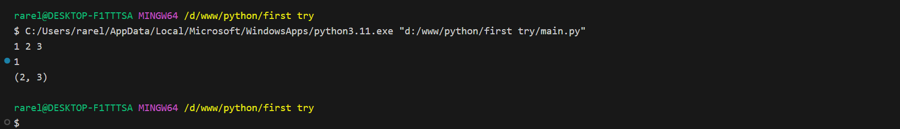
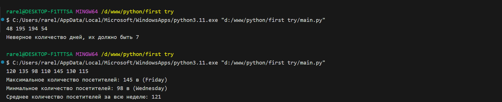

# Тема 6. Базовые коллекции: словари, кортежи
Отчет по Теме #6 выполнил(а):
- Сельков Вадим Андреевич
- АИС-22-1

| Задание | Лаб_раб | Сам_раб |
| ------ | ------ | ------ |
| Задание 1 | + | + |
| Задание 2 | + | + |
| Задание 3 | + | + |
| Задание 4 | + | + |
| Задание 5 | + | + |
| Задание 6 | - | - |
| Задание 7 | - | - |
| Задание 8 | - | - |
| Задание 9 | - | - |
| Задание 10 | - | - |

знак "+" - задание выполнено; знак "-" - задание не выполнено;

Работу проверили:
- к.э.н., доцент Панов М.А.

## Лабораторная работа №1
### В школе, где вы учились, узнали, что вы крутой программист и попросили написать программу для учителей, которая будет при вводе кабинета писать для него ключ доступа и статус, занят кабинет или нет. 

```python

request = int(input('Введите номер кабинета: '))

dictionary = {
  1: {'key': 101, 'access': True},
  2: {'key': 102, 'access': True},
  3: {'key': 103, 'access': True},
  4: {'key': 104, 'access': False},
  None: {'key': None, 'access': False}
}

response = dictionary.get(request)

if not response: 
  response = dictionary[None]

key = response['key']
access = response ['access']
print(f'Ключ: {key}, доступ: {access}')


```
### Результат.


## Лабораторная работа №2
### Алексей придумал создать самый большой словарь в мире. Для этого он придумал функцию dict_maker(**kwargs), которая принимает неограниченное количество параметров "ключ:значение" и обновляет созданный им словарь my_dict, состоящий всего из одного элемента "first" со значением "so easy". Помогите Алесею создать данную функцию. 

```python

my_dict = {'first': 'so easy'}

def dict_maker(**kwargs):
  my_dict.update(**kwargs)


dict_maker(a=1, b=2, c=3)
print(my_dict)

```
### Результат.


## Лабораторная работа №3
### Для решения некоторых задач необходимо разложить строку на отдельные символы. Мы знаем, что это можно сделать при помощи split(), у которого более гибкая настройка для разделения, но если нам нужно посимвольно разделить строку без всяких условий, то для этого нужно посимвольно разделить строку без всяких условий, то для этого мы можем использовать кортежи (tuple).

```python

x = 'Slovo'

list_of_letters = tuple(x)
print(list_of_letters)

```
### Результат.


## Лабораторная работа №4
### Вовочка решил написать крутую функцию, которая будет писать имя, возраст и место работы, но при этом на вход этой функции будет поступать кортеж. Помогите Вовочке написать эту программу. 

```python

def info(name, age, company):
  print(f'Имя: {name}, Возраст: {age}, Компания: {company}') 

info('Иван', 25, 'Google')
info('Петр', 29, 'Apple')


```
### Результат.


## Лабораторная работа №5
### Для сопровождения первых лиц государства X нужен кортеж, но никто не может определиться с порядком машин, поэтому вам нужно написать функцию, которая будет сортировать кортеж, состоящий из целых чисел по возрастанию, и возвращает его. Если хотя бы один элемент не является целым числом, то функция возвращает исходный кортеж.

```python

def tuple_sort(tpl):
  for elm in tpl:
    if not isinstance(elm, int):
      return tpl
  return tuple(sorted(tpl))

if __name__ == "__main__": 
  print(tuple_sort((32, 3, 5, 10)))
  print(tuple_sort((32, 6, 5.5, 10, 1)))


```
### Результат.


## Самостоятельная работа №1
### При Создании сайта у вас возникла потребность обрабатывать данные пользователя в странной форме, а потом переводить их в нужные форматы. Вы хотите принимать от пользователя последовательность чисел, разделенных пробелом, а после переформатировать эти данные в список и кортеж. Реализуйте ваше задумку. Для получения начальных данных используйте input(). Результатом программы будет выведенный список и кортеж из начальных данных. 

```python

x = input().split()
my_tuple = tuple(x)
print(f"Список = {x}\nКортеж = {my_tuple}")

```

### Результат.


## Вывод

В данной программе я научился отображать введеные данные сразу же в виде списка с помощью .split(), а также повторил функцию tuple()

## Самостоятельная работа №2
### Николай знает, что кортежи являются неизменяемыми, но он очень упрямый и всегда хочет доказать, что он прав. Студент решил создать функцию, которая будет удалять первое появление определенного элемента из кортежа по значению и возвращать кортеж без него. Попробуйте повторить шедевр не признающего авторитета начинающего программиста. Но учтите, что Николай не всегда уверен в наличии элемента в кортеже (в этом случае кортеж вернется функцией в исходном виде).

```python

def remove_tumple():
    x = input().split()
    my_tuple = set(map(int,x))
    b = int(input())
    if b in my_tuple:
        my_tuple.remove(b)
        return tuple(my_tuple)
    else:
        return tuple(my_tuple)

print(remove_tumple())


```

### Результат.



## Вывод

В данной программе я научился "удалять" элементы из кортежа, а также повторил функцию set()

## Самостоятельная работа №3
### Ребята поспорили кто из них одним нажатием на numpad наберет больше повторяющихся цифр, но не понимают, как узнать победителя. Вам и нужно в этом помочь. Дана строка в виде случайной последовательности чисел от 0 до 9 (длина строки минимум 15 символов). Требуется создать словарь, который в качестве ключей будет принимать данные числа (т.е. ключи будут типом int), а в качестве значений - количество этих чисел в имеющейся последовательности. Для построения словарясоздайте функцию, принимающую строку из цифр. Функция должна возвратить словарь из 3-х самых часто встречаемых чисел, также эти значениянужно вывести в порядке возрастания ключа.

```python

def numpad_winner(n):
  duplicate = []
  counter = {}
  new_array = []

  if len(n) < 15:
    print('Попробуйте ещё раз')
  else: 
    numbers = list(n)
    for item in numbers:
      if numbers.count(item) > 1:
        duplicate.append(item)
      else: 
        pass
    
    for item in duplicate:
      if item not in counter:
        counter[item] = 0
      counter[item] += 1

  new_array = sorted(counter.items(), key=lambda x: x[1], reverse=True)
  top_3 = new_array[:3]

  top_3_sorted = sorted(top_3, key=lambda x: (-x[1], x[0]))

  result = ', '.join([f"{key}: {value} раз(а)" for key, value in top_3_sorted])
  print(result)


numpad_winner(input())

```

### Результат.


## Вывод

Это задание было очень сложным, но я воспользовался своими знаниями из прошлой темы с помощью списков и множества постарался исполнить универсальное решение.

## Самостоятельная работа №4
### Ваш хороший друг владеет офисом со входом по электронным картам, ему нужно чтобы вы написали программу, которая показывала в каком порядке сотрудники входили и выходили из офисаю Определение сотрудника происходит по id. Напишите функцию, которая на вход принимает кортеж и случайный элемент (id), его можно придумать самостоятельно. Требуется вернуть новый кортеж, начинающийся с первого появления элемента в нем и заканчивающийся вторым его появлением включительно. 

### Если элемента нет вовсе - вернуть пустой кортеж 

### Если элемент встречается только один раз, то вернуть кортеж, который начинается с него и идет до конца исходного.

```python

def enters_inf(*args):
    info = input().split()
    enter_tuple = list(map(int, info))
    id = int(input())

    if id in enter_tuple and enter_tuple.count(id) == 1:
        enter_tuple = tuple(enter_tuple[enter_tuple.index(id):])
        print(enter_tuple)
    elif id in enter_tuple and enter_tuple.count(id) > 1:
        new_tuple = tuple(enter_tuple[enter_tuple.index(id)+1:])
        new_tuple = tuple(enter_tuple[enter_tuple.index(id):new_tuple.index(id) + enter_tuple.index(id) + 2])
        print(new_tuple)

    else:
        enter_tuple.clear()
        return print(tuple(enter_tuple))

enters_inf()

```

### Результат.


## Вывод

Эта программа действительно страшно выглядит, но исполняет вполне понятную задачу, благодаря срезам я сделал эту функцию универсальной

## Самостоятельная работа №5
### Придумайте своё задание, где обязательно будут задействованы кортежи или списки.

### В музее фиксируется количество посетителей каждый день в течение недели. Нужно написать программу, которая:
Принимает на вход кортеж или список с количеством посетителей за каждый день недели (7 чисел, начиная с понедельника).

### Выводит:

### День недели с максимальной посещаемостью.
### День недели с минимальной посещаемостью.
### Среднее количество посетителей за неделю.

```python

def week_info(*args):
  days_of_week = ['Monday', 'Tuesday', 'Wednesday', 'Thursday', 'Friday', 'Saturday', 'Sunday']
  attendance = input().split()
  attendance = [int(item) for item in attendance]

  if len(attendance) != 7:
    print('Неверное количество дней, их должно быть 7')
  else:
    max_attendance = max(attendance)
    max_day = days_of_week[attendance.index(max_attendance)]

    min_attendance = min(attendance)
    min_day = days_of_week[attendance.index(min_attendance)]


    day_attendance = int(sum(attendance) / len(attendance))

    print(
    f"Максимальное количество посетителей: {max_attendance} в ({max_day})\n"
    f"Минмальное количество посетителей: {min_attendance} в ({min_day})\n"
    f"Среднее количество посетителей за всю неделю: {day_attendance}"
    )


week_info()

```


### Результат.



## Вывод

Это задание мне придумал ИИ, но я его немного доработал, чтобы оно выглядело интереснее. Здесь я одновременно работал с двуями списками, отслеживал индексы одного из них.


## Общие выводы по теме

Данная лабораторная работа заставила меня посидеть и поседеть из-за кортежей и списков.

Я потратил достаточно времени, чтобы чувствовать себя напмного увереннее не только с перечисленными выше функциями, но и со словарями, которые до сих пор вызывают небольшой страх со своими "ключ-значенями"

Сделанные мной программы помогут мне в дальнейшем решении 7ой темы.
