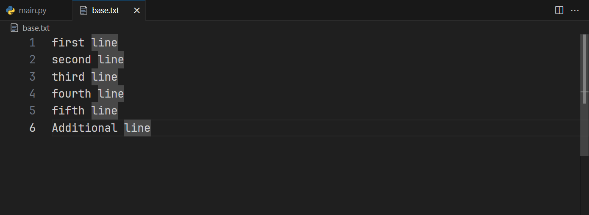
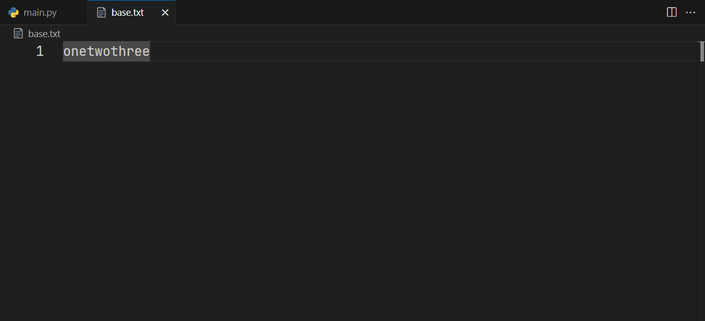
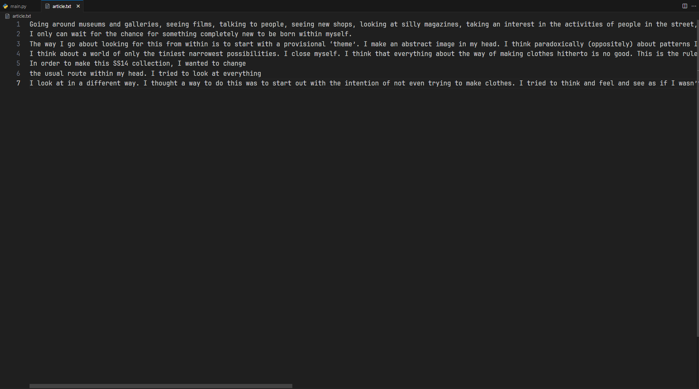
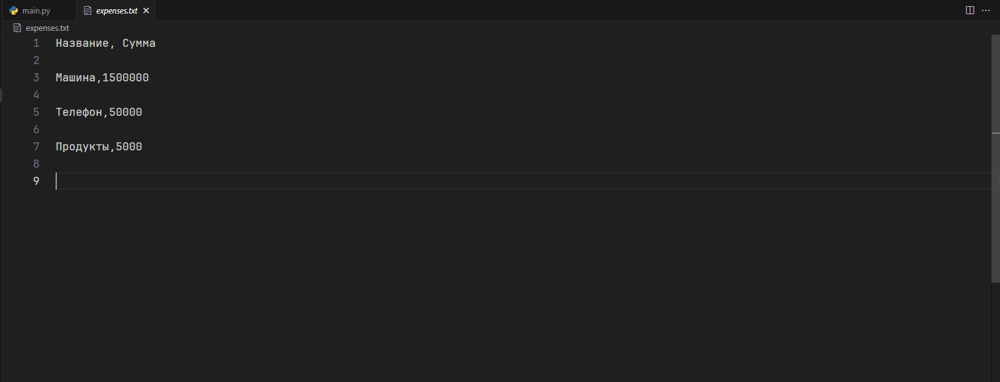

# Тема 7. Работа с файлами (ввод, вывод)
Отчет по Теме #7 выполнил(а):
- Сельков Вадим Андреевич
- АИС-22-1

| Задание | Лаб_раб | Сам_раб |
| ------ | ------ | ------ |
| Задание 1 | + | + |
| Задание 2 | + | + |
| Задание 3 | + | + |
| Задание 4 | + | + |
| Задание 5 | + | + |
| Задание 6 | + | - |
| Задание 7 | + | - |
| Задание 8 | + | - |
| Задание 9 | + | - |
| Задание 10 | + | - |

знак "+" - задание выполнено; знак "-" - задание не выполнено;

Работу проверили:
- к.э.н., доцент Панов М.А.

## Лабораторная работа №1
### Составьте текстовый файл и положите его в одну директорию с программой на Python. Тестовый файл должен состоять минимум из двух строк

```python


```
### Результат.


## Лабораторная работа №2
### Напишите программу, которая выведет только первую строку из вашего файла, при этом используйте конструкцию open()/close()

```python

file = open('base.txt', 'r')
print(file.readline())
file.close()

```
### Результат.


## Лабораторная работа №3
### Напишите программу, которая выведет все строки из вашего файла в массиве, при этом используйте конструкцию open()/close()

```python

file = open('base.txt', 'r')
print(file.readlines())
file.close()

```
### Результат.


## Лабораторная работа №4
### Напишите программу, которая выведет все строки из вашего файла в массиве, при этом используйте конструкцию with open().

```python

with open('base.txt', 'r') as f:
  print(f.readlines())

```
### Результат.


## Лабораторная работа №5
### Напишите программу, которая выведет каждую строку из вашего файла отдельно, при этом используйте конструкцию with open().

```python

with open('base.txt', 'r') as f:
  print(f.read())

```
### Результат.


## Лабораторная работа №6
### Напишите программу, которая будет добавлять новую строку в ваш файл, а потом выведет полученный файл в консоль. Вывод можно осуществлять любым способом. Обязательно проверьте сам файл, чтобы изменения в нем тоже отображались. 

```python

with open('base.txt', 'a') as f:
  f.write('\nAdditional line')

with open('base.txt', 'r') as r:
  print(r.readlines())

```
### Результат.



## Лабораторная работа №7
### Напишите программу, которая перепишет всю информацию, которая была у вас в файле до этого, например напишет любые данные из произвольно вами составленного списка. Также не забудьте проверить, что измененная вами информация сохранилась в файле.

```python

from email.mime import base


new_lines = ['one', 'two', 'three']

with open('base.txt', 'w') as f:
  f.writelines(new_lines)

with open('base.txt', 'r') as r:
  print('Done', r.read())

```
### Результат.




## Лабораторная работа №8
### Выберите любую папку на своем компьютере, имеющую вложенные директории. Выведите на печать в терминал её содержимое, как и всех подкаталогов при помощи функции print_docs(directory)

```python

import os 

def print_docs(directory):
  all_files = os.walk(directory)
  for catalog in all_files:
    print(f'Папка {catalog[0]} содержит:')
  print(f'Директории: {", ".join([folder for folder in catalog[1]])}')
  print(f'Файлы: {", ".join([file for file in catalog[2]])}')
  print('-' * 40)


print_docs("D:\Pictures")

  

```
### Результат.


## Лабораторная работа №9
### Требуется реализовать функцию, которая выводит слово, имеющее масимальную длину(или список слов, если таковых несколько). Проверьте работоспособность программы на своем наборе данных.

```python

def find_max(file):
    lines = []

    with open(file, encoding='utf-8') as f:
        for line in f:
            line = line.strip()  
            len_of_line = len(line)
            lines.append((line, len_of_line)) 

    lines.sort(key=lambda x: x[1], reverse=True)

    maximus = lines[0][1]

    max_length_lines = [line for line, length in lines if length == maximus]

    if len(max_length_lines) > 1:
        print(f"Несколько строк одинаковой максимальной длины ({maximus} символов):")
        for line in max_length_lines:
            print(f"Строка: '{line}'")
    else:
        print(f"Максимальная строка: '{lines[0][0]}' Длина: {maximus}")

find_max('base.txt')

```
### Результат.


## Лабораторная работа №10
### Требуется создать csv-файл "rows_300.csv" со следующими столбцами: 

### № - номер по порядку (от 1 до 300);
### Секунда - текущая секунда на вашем ПК;
### Микросекунда - текущая милисекунда на часах.

Для наглядности на каждой терации цикла искуственно приостанавливайте скрипт на 0,01 секунды. 

```python

import csv
import datetime 
import time 

with open('rows_300.csv', 'w', encoding='utf-8', newline='\r') as cf:
  writer = csv.writer(cf)
  writer.writerow(['№', ' Секунда ', ' Микросекунда '])
  for line in range(1, 301):
    writer.writerow([line, datetime.datetime.now().second,
                     datetime.datetime.now().microsecond])
    time.sleep(0.01)

```
### Результат.


## Самостоятельная работа №1
### Найдите в интернете любую статью(объем статьи не менее 200 слов), скопируйте её содержимое в файл и напишите программу, которая считает количество слов в текстовом файле и определит самое часто встречающееся слово. Результатом выполнения задачи будет: скриншот файла со статьей, листинг кода, и вывод в консоль, в котором будет указана вся необходимая информация. 

```python

def number_of_words(file):
    
    words = []  
    summa = []
    word_count = {}  

    with open(file, 'r', encoding='utf-8') as f:
        for line in f:
            line = line.lower().split()
            len_of_line = len(line)
            words.append((line, len_of_line))

            for word in line:
                if word in word_count:
                    word_count[word] += 1  
                else:
                    word_count[word] = 1
        
        for i, v in words:
            summa.append(v)
        
        print(f'Всего слов в статье: {sum(summa)}')

    word_with_maximus = max(word_count, key=word_count.get)
    maximus = max(word_count.values())

    print(f'самое часто повторяющееся слово в тексте: {word_with_maximus}\nОно повторяется: {maximus} раз')


number_of_words('article.txt')


```

### Результат.




## Вывод


## Самостоятельная работа №2
### У вас появилась потребность в ведении книги расходов, посмотрев все существующие варианты вы пришли к выводу, что вас ничего не устраивает и нужно все делать самому. Напишите программу для учета расходов. Программа должна позволять вводить информацию о рассходах, сохранять её в файл и выводить существующие данные в консоль. Ввод информации происходит через консоль. Результатом выполнения задачи будет: скриншот файла с учетом расходов, листинг кода, и вывод в консоль, с демонстрацией работоспособности программы.

```python

import csv
import os

def create_expenses():
  with open('expenses.txt', 'w', encoding='utf-8', newline= '\r') as cf:
    writer = csv.writer(cf)
    writer.writerow(['Название', ' Сумма'])
    print(writer)

    
def write_expenses():
  with open('expenses.txt', 'a', encoding='utf-8', newline= '\r') as wf:
    adder = csv.writer(wf)
    adder.writerow((input('Расход: '), input('Сумма: ')))

def show_expenses():
  with open('expenses.txt', 'r', encoding='utf-8') as rf:
    print(rf.read())


if __name__ == '__main__':
  if not os.path.exists('expenses.txt'):
        create_expenses()
  while True:
     first_dialoge = int(input('1: Внести расходы\n2: Показать расходы\n3: Выход\n'))
     if first_dialoge == 1:
        write_expenses()
     elif first_dialoge == 2:
        show_expenses()
     else:
        quit()

```

### Результат.




## Вывод


## Самостоятельная работа №3
### 

```python


```

### Результат.


## Вывод


## Самостоятельная работа №4
### 

```python


```

### Результат.


## Вывод


## Самостоятельная работа №5
### 


```python


```


### Результат.


## Вывод


## Общие выводы по теме


