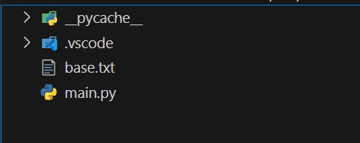
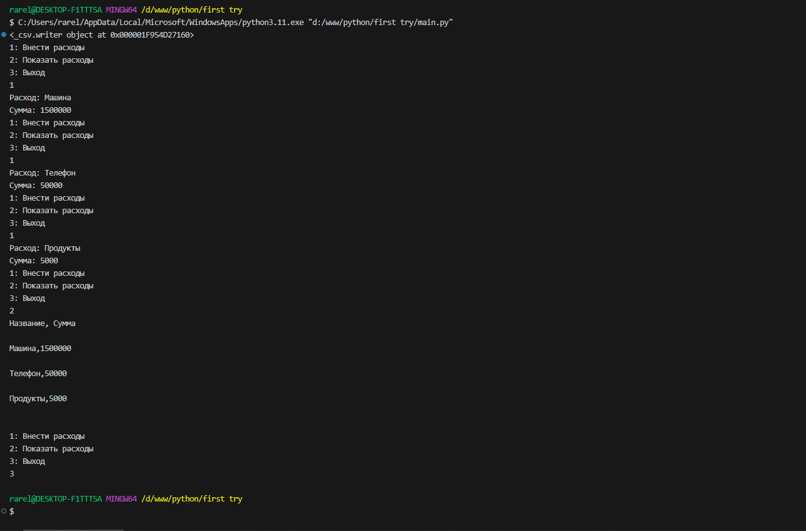

# Тема 7. Работа с файлами (ввод, вывод)
Отчет по Теме #7 выполнил(а):
- Сельков Вадим Андреевич
- АИС-22-1

| Задание | Лаб_раб | Сам_раб |
| ------ | ------ | ------ |
| Задание 1 | + | + |
| Задание 2 | + | + |
| Задание 3 | + | + |
| Задание 4 | + | + |
| Задание 5 | + | + |
| Задание 6 | + | - |
| Задание 7 | + | - |
| Задание 8 | + | - |
| Задание 9 | + | - |
| Задание 10 | + | - |

знак "+" - задание выполнено; знак "-" - задание не выполнено;

Работу проверили:
- к.э.н., доцент Панов М.А.

## Лабораторная работа №1
### Составьте текстовый файл и положите его в одну директорию с программой на Python. Тестовый файл должен состоять минимум из двух строк

```python


```
### Результат.



## Лабораторная работа №2
### Напишите программу, которая выведет только первую строку из вашего файла, при этом используйте конструкцию open()/close()

```python

file = open('base.txt', 'r')
print(file.readline())
file.close()

```
### Результат.


## Лабораторная работа №3
### Напишите программу, которая выведет все строки из вашего файла в массиве, при этом используйте конструкцию open()/close()

```python

file = open('base.txt', 'r')
print(file.readlines())
file.close()

```
### Результат.


## Лабораторная работа №4
### Напишите программу, которая выведет все строки из вашего файла в массиве, при этом используйте конструкцию with open().

```python

with open('base.txt', 'r') as f:
  print(f.readlines())

```
### Результат.


## Лабораторная работа №5
### Напишите программу, которая выведет каждую строку из вашего файла отдельно, при этом используйте конструкцию with open().

```python

with open('base.txt', 'r') as f:
  print(f.read())

```
### Результат.


## Лабораторная работа №6
### Напишите программу, которая будет добавлять новую строку в ваш файл, а потом выведет полученный файл в консоль. Вывод можно осуществлять любым способом. Обязательно проверьте сам файл, чтобы изменения в нем тоже отображались. 

```python

with open('base.txt', 'a') as f:
  f.write('\nAdditional line')

with open('base.txt', 'r') as r:
  print(r.readlines())

```
### Результат.


## Лабораторная работа №7
### Напишите программу, которая перепишет всю информацию, которая была у вас в файле до этого, например напишет любые данные из произвольно вами составленного списка. Также не забудьте проверить, что измененная вами информация сохранилась в файле.

```python

from email.mime import base


new_lines = ['one', 'two', 'three']

with open('base.txt', 'w') as f:
  f.writelines(new_lines)

with open('base.txt', 'r') as r:
  print('Done', r.read())

```
### Результат.


## Лабораторная работа №8
### Выберите любую папку на своем компьютере, имеющую вложенные директории. Выведите на печать в терминал её содержимое, как и всех подкаталогов при помощи функции print_docs(directory)

```python

import os 

def print_docs(directory):
  all_files = os.walk(directory)
  for catalog in all_files:
    print(f'Папка {catalog[0]} содержит:')
  print(f'Директории: {", ".join([folder for folder in catalog[1]])}')
  print(f'Файлы: {", ".join([file for file in catalog[2]])}')
  print('-' * 40)


print_docs("D:\Pictures")

  

```
### Результат.


## Лабораторная работа №9
### Требуется реализовать функцию, которая выводит слово, имеющее масимальную длину(или список слов, если таковых несколько). Проверьте работоспособность программы на своем наборе данных.

```python


```
### Результат.


## Лабораторная работа №10
### 

```python


```
### Результат.


## Самостоятельная работа №1
### 

```python


```

### Результат.


## Вывод


## Самостоятельная работа №2
### 

```python


```

### Результат.



## Вывод


## Самостоятельная работа №3
### 

```python


```

### Результат.


## Вывод


## Самостоятельная работа №4
### 

```python


```

### Результат.


## Вывод


## Самостоятельная работа №5
### 


```python


```


### Результат.


## Вывод


## Общие выводы по теме


