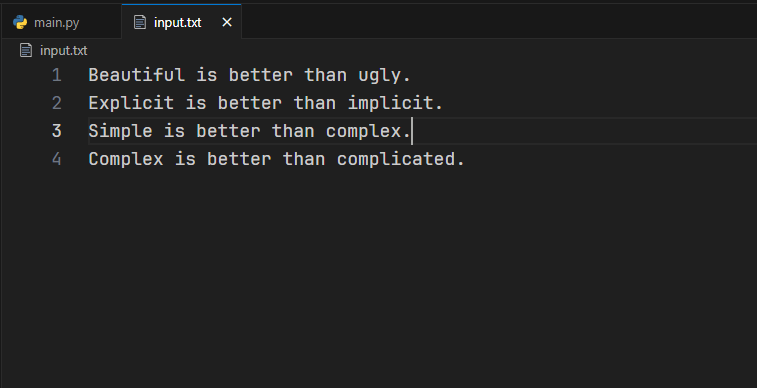
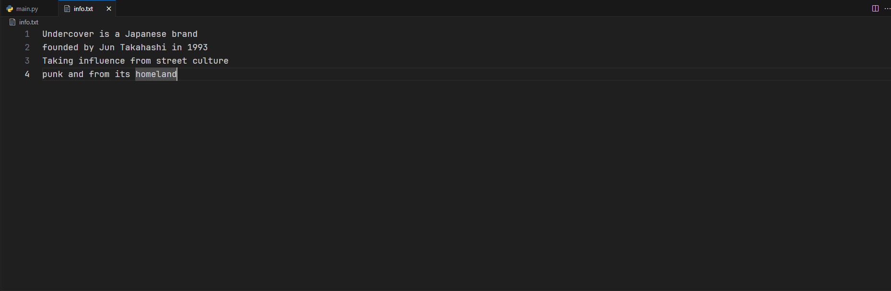

Тема 7. Работа с файлами (ввод, вывод)
Отчет по Теме #7 выполнил(а):
- Сельков Вадим Андреевич
- АИС-22-1

| Задание | Лаб_раб | Сам_раб |
| ------ | ------ | ------ |
| Задание 1 | + | + |
| Задание 2 | + | + |
| Задание 3 | + | + |
| Задание 4 | + | + |
| Задание 5 | + | + |
| Задание 6 | + | - |
| Задание 7 | + | - |
| Задание 8 | + | - |
| Задание 9 | + | - |
| Задание 10 | + | - |

знак "+" - задание выполнено; знак "-" - задание не выполнено;

Работу проверили:
- к.э.н., доцент Панов М.А.

## Лабораторная работа №1
### Составьте текстовый файл и положите его в одну директорию с программой на Python. Тестовый файл должен состоять минимум из двух строк

### Результат.


## Лабораторная работа №2
### Напишите программу, которая выведет только первую строку из вашего файла, при этом используйте конструкцию open()/close()

```python

file = open('base.txt', 'r')
print(file.readline())
file.close()

```
### Результат.


## Лабораторная работа №3
### Напишите программу, которая выведет все строки из вашего файла в массиве, при этом используйте конструкцию open()/close()

```python

file = open('base.txt', 'r')
print(file.readlines())
file.close()

```
### Результат.


## Лабораторная работа №4
### Напишите программу, которая выведет все строки из вашего файла в массиве, при этом используйте конструкцию with open().

```python

with open('base.txt', 'r') as f:
  print(f.readlines())

```
### Результат.


## Лабораторная работа №5
### Напишите программу, которая выведет каждую строку из вашего файла отдельно, при этом используйте конструкцию with open().

```python

with open('base.txt', 'r') as f:
  print(f.read())

```
### Результат.


## Лабораторная работа №6
### Напишите программу, которая будет добавлять новую строку в ваш файл, а потом выведет полученный файл в консоль. Вывод можно осуществлять любым способом. Обязательно проверьте сам файл, чтобы изменения в нем тоже отображались. 

```python

with open('base.txt', 'a') as f:
  f.write('\nAdditional line')

with open('base.txt', 'r') as r:
  print(r.readlines())

```
### Результат.


## Лабораторная работа №7
### Напишите программу, которая перепишет всю информацию, которая была у вас в файле до этого, например напишет любые данные из произвольно вами составленного списка. Также не забудьте проверить, что измененная вами информация сохранилась в файле.

```python

from email.mime import base


new_lines = ['one', 'two', 'three']

with open('base.txt', 'w') as f:
  f.writelines(new_lines)

with open('base.txt', 'r') as r:
  print('Done', r.read())

```
### Результат.


## Лабораторная работа №8
### Выберите любую папку на своем компьютере, имеющую вложенные директории. Выведите на печать в терминал её содержимое, как и всех подкаталогов при помощи функции print_docs(directory)

```python

import os 

def print_docs(directory):
  all_files = os.walk(directory)
  for catalog in all_files:
    print(f'Папка {catalog[0]} содержит:')
  print(f'Директории: {", ".join([folder for folder in catalog[1]])}')
  print(f'Файлы: {", ".join([file for file in catalog[2]])}')
  print('-' * 40)


print_docs("D:\Pictures")

  

```
### Результат.


## Лабораторная работа №9
### Требуется реализовать функцию, которая выводит слово, имеющее масимальную длину(или список слов, если таковых несколько). Проверьте работоспособность программы на своем наборе данных.

```python

def find_max(file):
    lines = []

    with open(file, encoding='utf-8') as f:
        for line in f:
            line = line.strip()  
            len_of_line = len(line)
            lines.append((line, len_of_line)) 

    lines.sort(key=lambda x: x[1], reverse=True)

    maximus = lines[0][1]

    max_length_lines = [line for line, length in lines if length == maximus]

    if len(max_length_lines) > 1:
        print(f"Несколько строк одинаковой максимальной длины ({maximus} символов):")
        for line in max_length_lines:
            print(f"Строка: '{line}'")
    else:
        print(f"Максимальная строка: '{lines[0][0]}' Длина: {maximus}")

find_max('base.txt')

```
### Результат.


## Лабораторная работа №10
### Требуется создать csv-файл "rows_300.csv" со следующими столбцами: 

### № - номер по порядку (от 1 до 300);
### Секунда - текущая секунда на вашем ПК;
### Микросекунда - текущая милисекунда на часах.

Для наглядности на каждой терации цикла искуственно приостанавливайте скрипт на 0,01 секунды. 

```python

import csv
import datetime 
import time 

with open('rows_300.csv', 'w', encoding='utf-8', newline='\r') as cf:
  writer = csv.writer(cf)
  writer.writerow(['№', ' Секунда ', ' Микросекунда '])
  for line in range(1, 301):
    writer.writerow([line, datetime.datetime.now().second,
                     datetime.datetime.now().microsecond])
    time.sleep(0.01)

```
### Результат.


## Самостоятельная работа №1
### Найдите в интернете любую статью(объем статьи не менее 200 слов), скопируйте её содержимое в файл и напишите программу, которая считает количество слов в текстовом файле и определит самое часто встречающееся слово. Результатом выполнения задачи будет: скриншот файла со статьей, листинг кода, и вывод в консоль, в котором будет указана вся необходимая информация. 

```python

def number_of_words(file):
    
    words = []  
    summa = []
    word_count = {}  

    with open(file, 'r', encoding='utf-8') as f:
        for line in f:
            line = line.lower().split()
            len_of_line = len(line)
            words.append((line, len_of_line))

            for word in line:
                if word in word_count:
                    word_count[word] += 1  
                else:
                    word_count[word] = 1
        
        for i, v in words:
            summa.append(v)
        
        print(f'Всего слов в статье: {sum(summa)}')

    word_with_maximus = max(word_count, key=word_count.get)
    maximus = max(word_count.values())

    print(f'самое часто повторяющееся слово в тексте: {word_with_maximus}\nОно повторяется: {maximus} раз')


number_of_words('article.txt')


```

### Результат.


## Вывод

В данной программе я научился новому способу оформаления списка, который подразумевает в себе формирование кортежа. Обращаться к его значениям можно через индексы. Также повторил обращения к значениям по ключам.

## Самостоятельная работа №2
### У вас появилась потребность в ведении книги расходов, посмотрев все существующие варианты вы пришли к выводу, что вас ничего не устраивает и нужно все делать самому. Напишите программу для учета расходов. Программа должна позволять вводить информацию о рассходах, сохранять её в файл и выводить существующие данные в консоль. Ввод информации происходит через консоль. Результатом выполнения задачи будет: скриншот файла с учетом расходов, листинг кода, и вывод в консоль, с демонстрацией работоспособности программы.

```python

import csv
import os

def create_expenses():
  with open('expenses.txt', 'w', encoding='utf-8', newline= '\r') as cf:
    writer = csv.writer(cf)
    writer.writerow(['Название', ' Сумма'])
    print(writer)

    
def write_expenses():
  with open('expenses.txt', 'a', encoding='utf-8', newline= '\r') as wf:
    adder = csv.writer(wf)
    adder.writerow((input('Расход: '), input('Сумма: ')))

def show_expenses():
  with open('expenses.txt', 'r', encoding='utf-8') as rf:
    print(rf.read())


if __name__ == '__main__':
  if not os.path.exists('expenses.txt'):
        create_expenses()
  while True:
     first_dialoge = int(input('1: Внести расходы\n2: Показать расходы\n3: Выход\n'))
     if first_dialoge == 1:
        write_expenses()
     elif first_dialoge == 2:
        show_expenses()
     else:
        quit()

```

### Результат.


## Вывод

В данной программе я впервые самостоятельно воспользовался модулем csv, который позваляет представлять табличные данные. Я немного осложнил себе задачу и сделал разнообразнее само задание. В моей программеприсутствует модуль os, который нужен для проверки существования файла, если он существует - то открывается уже созданный хранящийся до этого файл - иначе создает и оформляет по определенному патерну файл. Также сущесвует вариант выхода из программы.

## Самостоятельная работа №3
### Имеется файл input.txt с текстом на латинице. Напишите программу, которая выводит следующую статистику по тексту: количество букв латинского алфавита; число слов; число строк

### Текст в файле: 

Beautiful is better than ugly.
Explicit is better than implicit.
Simple is better than complex. 
Complex is better than complicated.

### Ожидаемый результат: 

Input file contains:
108 letters
20 words
4 lines

```python

with open('input.txt', 'r') as f:
  content = ''.join([line.rstrip('.\n') + '\n' for line in f])
  print (
    f"Input file contains:\n"
    f"{len(''.join(content.split()))} letters\n"
    f"{len(content.split())} words\n"
    f"{len(content.splitlines())} lines"
  )

```

### Результат.




## Вывод

Данная программа дала мне возможность познакомится с методом splitlines(), который разбивает возвращает список строк, текста str, разделенного по универсальным разрывам строк. 

## Самостоятельная работа №4
### Напишите программу, которая получает на выход предложение, выводит его в терминал, заменяя все запрещенные слова звездочками * (кол-во звездочек равно количеству букв в слове). Запрещенные слова, разделенные символом пробела, хранятся в текстовом файле input.txt. Все слова в этом файле хаписаны в нижнем регистре. Программа должна заменить запрещенные слова, где бы они ни встречались, даже в середине другого слова. Замена производится независимо от регистра: если файл input.txt содержит запрещенное слово exam, то слова exam, Exam, ExaM, EXAM и exAm должны быть заменены на ****.

### Запрещенные слова:

### hello email python exam wor is

```python

def censorship(taken_info):
    with open('input.txt', 'r') as f:
        
        content = f.read()
        list_of_content = list(content.split())
        x = taken_info.lower()

        for word in list_of_content:
            x = x.replace(word, '*' * len(word))

        new_line = ''

        for i in range(len(taken_info)):
            if x[i] == '*':
                new_line += x[i]
            else:
                new_line += taken_info[i]
        print(new_line)

censorship(input())

```

### Результат.


## Вывод

Задача имела достаточно трудное условие. Я подошел к решение со спобосом хранение оригинального введенего текста, создания дубликата, и дальнейшем сравнении данных двух значений. Новых функция данная программа не предполагала, скорее, логическое и нестандартное мышление.

## Самостоятельная работа №5
### Самостоятельно придумайте и решите задачу, которая будет взаимодействовать с текстовым файлом.

### Напишите программу, которая принимает на вход текстовый файл, содержащий строки текста. Программа должна вывести следующую информацию:

### Количество слов в файле
### Самое длинное слово
### Самое короткое слово
### Кличество строк, содержащих цифры

```python

with open('info.txt', 'r', encoding='utf-8') as f:

    maximus = []
    c = 0

    content = f.read()

    number_of_words = len(content.split())

    lines = content.split()

    maximus.append((0,[len(word) for word in lines]))

    for word in lines:
        if word.isdigit():
            c += 1

    print(
        f'Всего слов: {number_of_words}\n'
        f'Самое длинное слово: "{max(lines, key=len)}", И его длина: {max(maximus[0][1])}\n'
        f'Самое короткое слово: "{min(lines, key=len)}", И его длина: {min(maximus[0][1])}\n'
        f'Количество строк с цифрами: {c}'
    )

"""
Undercover is a Japanese brand
founded by Jun Takahashi in 1993
Taking influence from street culture
punk and from its homeland
"""

```


### Результат.


 - с файлом

## Вывод

В данном задании я придумал собственное условие, благодаря которому, как мне кажется, повторил свои знания, связанные с листом и добавлением внего кортежа. Также познакомился с новым способом поиска максимального и минимального значений по ключу с помощью max(lines, key=len).

## Общие выводы по теме


