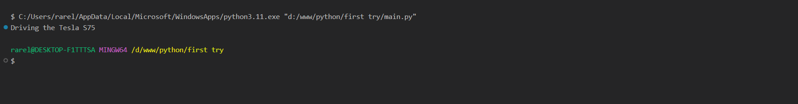
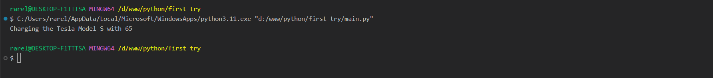
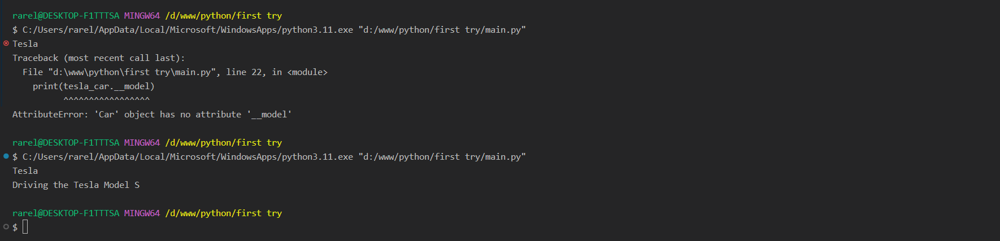
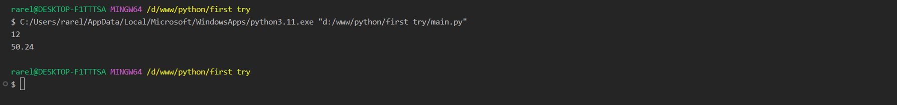
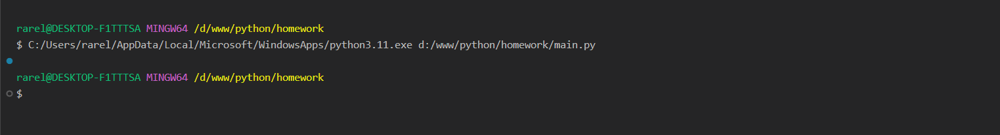
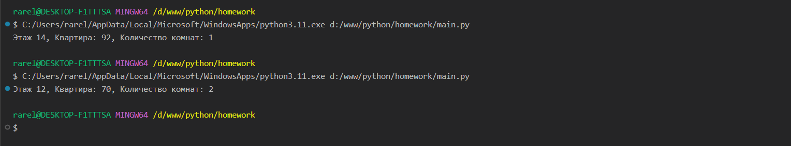
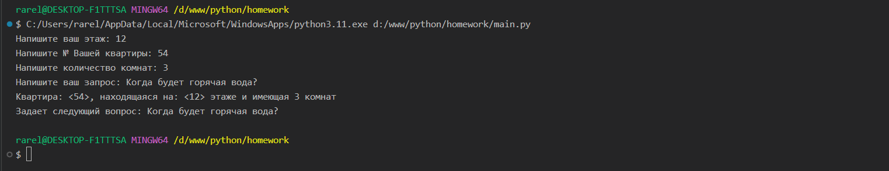
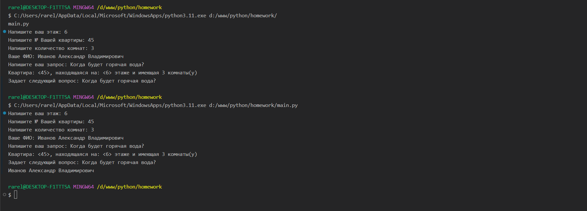
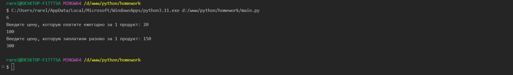

Тема 8. Основы объектно-ориентированного программирования
Отчет по Теме #8 выполнил(а):
- Сельков Вадим Андреевич
- АИС-22-1

| Задание | Лаб_раб | Сам_раб |
| ------ | ------ | ------ |
| Задание 1 | + | + |
| Задание 2 | + | + |
| Задание 3 | + | + |
| Задание 4 | + | + |
| Задание 5 | + | + |
| Задание 6 | - | - |
| Задание 7 | - | - |
| Задание 8 | - | - |
| Задание 9 | - | - |
| Задание 10 | - | - |

знак "+" - задание выполнено; знак "-" - задание не выполнено;

Работу проверили:
- к.э.н., доцент Панов М.А.

## Лабораторная работа №1
### Создайте класс “Car” с атрибутами производитель и модель. Создайте объект этого класса. Напишите комментарии для кода, объясняющие его работу. Результатом выполнения задания будет листинг кода с комментариями.

```python

class Car: # Создаем класс
  def __init__(self, creator, model):
    """
    Функция __init__ является конструктором класса, 
    которая прописывает главные атрибуты
    """
    self.creator = creator # атрибут производитель  
    self.model = model # атрибут модель


my_car = Car("Tesla", "S75") # вызов класса с опреденным производителем и моделью


```


## Лабораторная работа №2
### Дополните код из первого задания, добавив в него атрибуты и методы класса, заставьте машину “поехать”. Напишите комментарии для кода, объясняющие его работу. Результатом выполнения задания будет листинг кода с комментариями и получившийся вывод в консоль.

```python

class Car: # Создаем класс
  def __init__(self, creator, model):
    """
    Функция __init__ является конструктором класса, 
    которая прописывает главные атрибуты
    """
    self.creator = creator # атрибут производитель  
    self.model = model # атрибут модель

  def drive(self):
    print(f"Driving the {self.creator} {self.model}") # вывод 


my_car = Car("Tesla", "S75") # вызов класса с опреденным производителем и моделью
my_car.drive() # Вызов функции drive класса Car

```
### Результат.



## Лабораторная работа №3
### Создайте новый класс “ElectricCar” с методом “charge” и атрибутом емкость батареи. Реализуйте его наследование от класса, созданного в первом задании. Заставьте машину поехать, а потом заряжаться. Михаил А. Панов Напишите комментарии для кода, объясняющие его работу. Результатом выполнения задания будет листинг кода с комментариями и получившийся вывод в консоль.

```python

class Car:  # Создаем базовый класс

    def __init__(self, creator, model):
        self.creator = creator
        self.model = model
    """
    Функция __init__ является конструктором класса, 
        которая прописывает главные атрибуты
    """

class ElectricCar(Car): # Создаем класс и указываем родительский 
  def __init__(self, creator, model, battery):

    super().__init__(creator, model)

    """
    super().__init__(creator, model) вызывает конструктор родительского класса Car, 
        чтобы инициализировать атрибуты creator и model.
    """

    self.battery = battery # прописываем дополнительный атрибут

  def charge(self):
    """
    Метод charge выводит строку, которая сообщает, что машина заряжается, 
        указывая ее марку, модель и емкость батареи.
    """
    print(f"Charging the {self.creator} {self.model} with {self.battery}") # вывод 

  

tesla_car = ElectricCar("Tesla", "Model S", 65) # передача в объект атрибуты класса ElectricCar
tesla_car.charge() # Вызов функции charge

```
### Результат.



## Лабораторная работа №4
### Реализуйте инкапсуляцию для класса, созданного в первом задании. Создайте защищенный атрибут производителя и приватный атрибут модели. Вызовите защищенный атрибут и заставьте машину поехать. Напишите комментарии для кода, объясняющие его работу. Результатом выполнения задания будет листинг кода с комментариями и получившийся вывод в консоль.

```python

class Car:  # Создаем класс

    def __init__(self, creator, model):
        self._creator = creator # защищенный атрибут 
        self.__model = model # приватный атрибут 
    """
    Функция __init__ является конструктором класса, 
        которая прописывает главные атрибуты
    """

    def drive(self):
      """
      Метод drive выводит строку, которая сообщает, что машина едет, 
          указывая ее марку и модель.
      """
      print(f"Driving the {self._creator} {self.__model}") # вывод 

  

tesla_car = Car("Tesla", "Model S") 
print(tesla_car._creator) # доступ к защищенному атрибуту
# print(tesla_car.__model) Ошибка, так как этот атрибут является приватным
tesla_car.drive() # Вызов функции charge

```
### Результат.



## Лабораторная работа №5
### Реализуйте полиморфизм создав основной (общий) класс “Shape”, а также еще два класса “Rectangle” и “Circle”. Внутри последних двух классов реализуйте методы для подсчета площади фигуры. После этого создайте массив с фигурами, поместите туда круг и прямоугольник, затем при помощи цикла выведите их площади. Напишите комментарии для кода, объясняющие его работу. Результатом выполнения задания будет листинг кода с комментариями и получившийся вывод в консоль.

```python

class Shape:
  def area(self):
    pass


class Rectangle(Shape):
  def __init__(self, a, b):
    self.a = a
    self.b = b
  
  def area(self):
    return self.a * self.b
  

class Circle(Shape):
  def __init__(self, r):
    self.r = r
  

  def area(self):
    return 3.14 * self.r * self.r
  

shapes = [Rectangle(3,4), Circle(4)]

for shape in shapes:
  print(shape.area())


```

### Результат.




## Самостоятельная работа 1
### Самостоятельно создайте класс и его объект. Они должны отличаться, от тех, что указаны в теоретическом материале (методичке) и лабораторных заданиях. Результатом выполнения задания будет листинг кода и получившийся вывод консоли

```python

class Home:
  def __init__(self):
    pass


my_home = Home()

```

### Результат.



## Вывод


## Самостоятельная работа №2
### Самостоятельно создайте атрибуты и методы для ранее созданного класса. Они должны отличаться, от тех, что указаны в теоретическом материале (методичке) и лабораторных заданиях. Результатом выполнения задания будет листинг кода и получившийся вывод консоли.

```python

class Home:
  def __init__(self, floor, flat, number_of_rooms):
    self.floor = floor 
    self.flat = flat 
    self.number_of_rooms = number_of_rooms
  
  def show_info(self):
    print(f"Этаж {self.floor}, Квартира: {self.flat}, Количество комнат: {self.number_of_rooms}")


my_home = Home(12, 70, 2)
my_home.show_info()

```

### Результат.



## Вывод


## Самостоятельная работа №3
### Самостоятельно реализуйте наследование, продолжая работать с ранее созданным классом. Оно должно отличаться, от того, что указано в теоретическом материале (методичке) и лабораторных заданиях. Результатом выполнения задания будет листинг кода и получившийся вывод консоли.

```python

class Home:
  def __init__(self, floor, flat, number_of_rooms):
    self.floor = floor 
    self.flat = flat 
    self.number_of_rooms = number_of_rooms
  

class JKH(Home):
  def __init__(self, floor, flat, number_of_rooms):
    super().__init__(floor, flat, number_of_rooms)

  def make_appeal(self, ask):
    self.ask = ask

  def show_appeal(self):
    print(
        f"Квартира: <{self.flat}>, находящаяся на: <{self.floor}> этаже и имеющая {self.number_of_rooms} комнат\n"
        f"Задает следующий вопрос: {self.ask}"
        )
    


someones_home = JKH(
    input("Напишите ваш этаж: "),
    input("Напишите № Вашей квартиры: "),
    input("Напишите количество комнат: ")
    )
someones_home.make_appeal(input("Напишите ваш запрос: "))
someones_home.show_appeal()

```

### Результат.



## Вывод


## Самостоятельная работа №4
### Самостоятельно реализуйте инкапсуляцию, продолжая работать с ранее созданным классом. Она должна отличаться, от того, что указана в теоретическом материале (методичке) и лабораторных заданиях. Результатом выполнения задания будет листинг кода и получившийся вывод консоли.

```python


```

### Результат.



## Вывод


## Самостоятельная работа №5
### Самостоятельно реализуйте полиморфизм. Он должен отличаться, от того, что указан в теоретическом материале (методичке) и лабораторных заданиях. Результатом выполнения задания будет листинг кода и получившийся вывод консоли.

```python


```

### Результат.



## Вывод


## Общие выводы по теме


