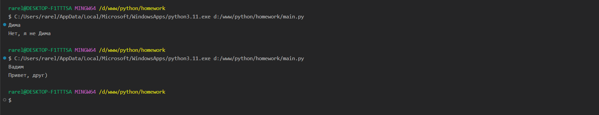
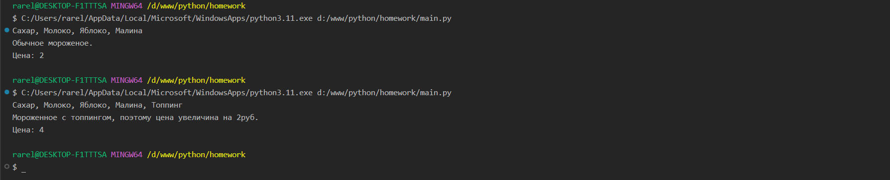
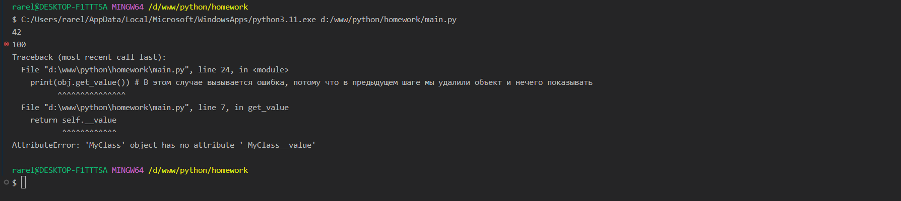
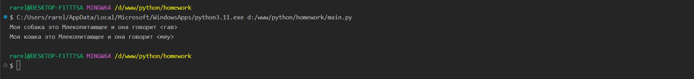
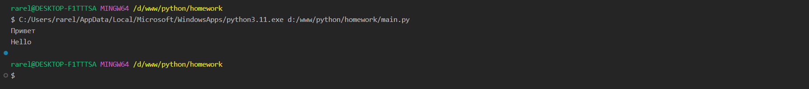

Тема 9. ООП на Python: концепции, принципы и примеры реализации
Отчет по Теме #9 выполнил(а):
- Сельков Вадим Андреевич
- АИС-22-1

| Задание | Лаб_раб | Сам_раб |
| ------ | ------ | ------ |
| Задание 1 | + | + |
| Задание 2 | + | - |
| Задание 3 | + | - |
| Задание 4 | + | - |
| Задание 5 | + | - |
| Задание 6 | - | - |
| Задание 7 | - | - |
| Задание 8 | - | - |
| Задание 9 | - | - |
| Задание 10 | - | - |

знак "+" - задание выполнено; знак "-" - задание не выполнено;

Работу проверили:
- к.э.н., доцент Панов М.А.

## Лабораторная работа №1
### Допустим, что вы решили оригинально и немного странно познакомится с человеком. Для этого у вас должен быть написан свой класс на Python, который будет проверять угадал ваше имя человек или нет. Для этого создайте класс, указав в свойствах только имя. Дальше создайте функцию __init__(), а в ней сделайте проверку на то угадал человек ваше имя или нет. Также можете проверить что будет, если в этой функции указав атрибут, который не указан в вашем классе, например, попробуйте вызвать фамилию.

```python

class Guess:
  def __init__(self, name):
    self.name = name 

  def check_friendship(self):
      if self.name != "Вадим":
        print(f'Нет, я не {self.name}')
      else:
        print('Привет, друг)')


guess_game = Guess(input())
guess_game.check_friendship()


```
### Результат.


## Лабораторная работа №2
### Вам дали важное задание, написать продавцу мороженого программу, которая будет писать добавили ли топпинг в мороженое и цену после возможного изменения. Для этого вам нужно написать класс, в котором будет определяться изменили ли состав мороженого или нет. В этом классе реализуйте метод, выводящий на печать «Мороженое с {ТОППИНГ}» в случае наличия добавки, а иначе отобразится следующая фраза: «Обычное мороженое». При этом программа должна воспринимать как топпинг только атрибуты типа string.

```python

class DefaultIceCream:

  def __init__(self, price, ingredients):

    self.price = price
    self.ingredients = ingredients.split(', ')

  def check_topping(self):

    if 'Топпинг' in self.ingredients:

      self.price += 2
      
      print(
        f'Мороженное с топпингом, поэтому цена увеличина на 2руб.\n'
        f'Цена: {self.price}'
      )

    else:
      print(
        f'Обычное мороженое.\n'
        f'Цена: {self.price}'
      )


ice_cream = DefaultIceCream(2, input())
ice_cream.check_topping()

```
### Результат.


## Лабораторная работа №3
### Петя – начинающий программист и на занятиях ему сказали реализовать икапсу… что-то. А вы хороший друг Пети и ко всему прочему прекрасно знаете, что икапсу…что-то – это инкапсуляция, поэтому решаете помочь вашему другу с написанием класса с инкапсуляцией. Ваш класс будет не просто инкапсуляцией, а классом с сеттером, геттером и деструктором. После написания класса вам необходимо продемонстрировать что все написанные вами функции работают. Также вас необходимо объяснить Пете почему на скриншоте ниже в консоли выводится ошибка

```python

class MyClass:
  def __init__(self, value):
    self.__value = value 


  def get_value(self):
    return self.__value  

  def set_value(self, value):
    self.__value = value


  def del_value(self):
    del self.__value

  value = property(get_value, set_value, del_value)


obj = MyClass(42)
print(obj.get_value())
obj.set_value(100)
print(obj.get_value())
obj.del_value()
print(obj.get_value()) # В этом случае вызывается ошибка, потому что в предыдущем шаге мы удалили объект и нечего показывать 


```
### Результат.


## Лабораторная работа №4
### Вам прекрасно известно, что кошки и собаки являются млекопитающими, но компьютер этого не понимает, поэтому вам нужно написать три класса: Кошки, Собаки, Млекопитающие. И при помощи “наследования” объяснить компьютеру что кошки и собаки – это млекопитающие. Также добавьте какой-нибудь свой атрибут для кошек и собак, чтобы показать, что они чем-то отличаются друг от друга.

```python


```
### Результат.


## Лабораторная работа №5
### 

```python

```
### Результат.


## Самостоятельная работа 1
### 

```python


```

### Результат.


## Вывод


## Общие выводы по теме


