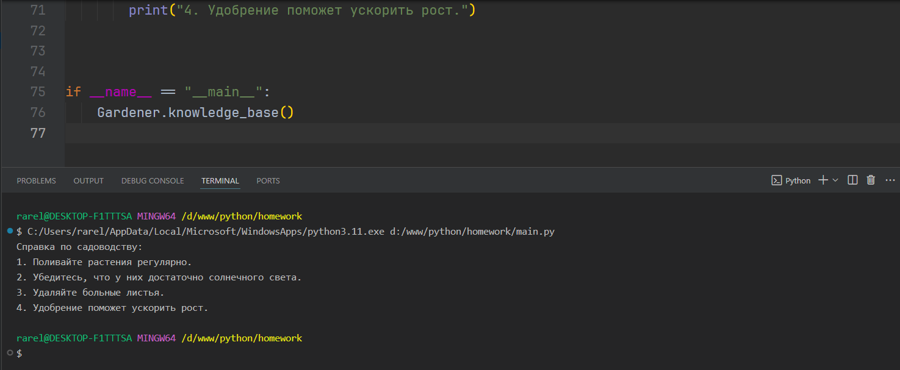
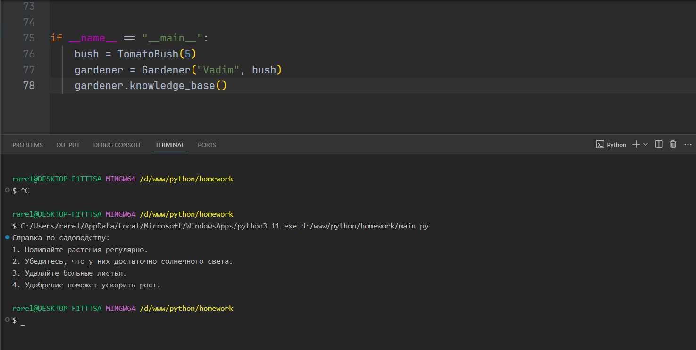
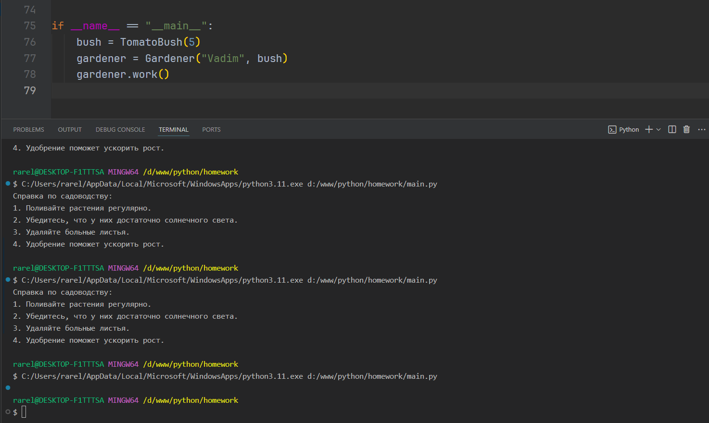
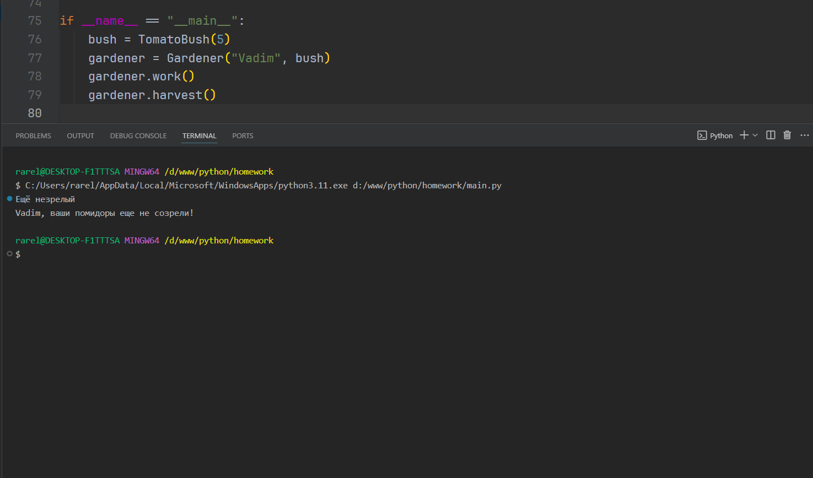
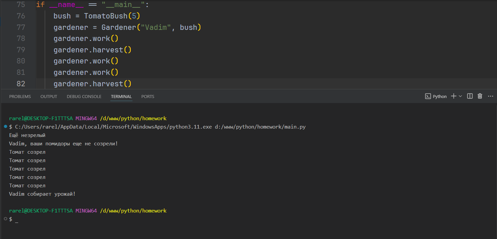

Тема 9. ООП на Python: концепции, принципы и примеры реализации
Отчет по Теме #9 выполнил(а):
- Сельков Вадим Андреевич
- АИС-22-1

| Задание | Лаб_раб | Сам_раб |
| ------ | ------ | ------ |
| Задание 1 | + | + |
| Задание 2 | + | - |
| Задание 3 | + | - |
| Задание 4 | + | - |
| Задание 5 | + | - |
| Задание 6 | - | - |
| Задание 7 | - | - |
| Задание 8 | - | - |
| Задание 9 | - | - |
| Задание 10 | - | - |

знак "+" - задание выполнено; знак "-" - задание не выполнено;

Работу проверили:
- к.э.н., доцент Панов М.А.

## Лабораторная работа №1
### Допустим, что вы решили оригинально и немного странно познакомится с человеком. Для этого у вас должен быть написан свой класс на Python, который будет проверять угадал ваше имя человек или нет. Для этого создайте класс, указав в свойствах только имя. Дальше создайте функцию __init__(), а в ней сделайте проверку на то угадал человек ваше имя или нет. Также можете проверить что будет, если в этой функции указав атрибут, который не указан в вашем классе, например, попробуйте вызвать фамилию.

```python

class Guess:
  def __init__(self, name):
    self.name = name 

  def check_friendship(self):
      if self.name != "Вадим":
        print(f'Нет, я не {self.name}')
      else:
        print('Привет, друг)')


guess_game = Guess(input())
guess_game.check_friendship()


```
### Результат.


## Лабораторная работа №2
### Вам дали важное задание, написать продавцу мороженого программу, которая будет писать добавили ли топпинг в мороженое и цену после возможного изменения. Для этого вам нужно написать класс, в котором будет определяться изменили ли состав мороженого или нет. В этом классе реализуйте метод, выводящий на печать «Мороженое с {ТОППИНГ}» в случае наличия добавки, а иначе отобразится следующая фраза: «Обычное мороженое». При этом программа должна воспринимать как топпинг только атрибуты типа string.

```python

class DefaultIceCream:

  def __init__(self, price, ingredients):

    self.price = price
    self.ingredients = ingredients.split(', ')

  def check_topping(self):

    if 'Топпинг' in self.ingredients:

      self.price += 2
      
      print(
        f'Мороженное с топпингом, поэтому цена увеличина на 2руб.\n'
        f'Цена: {self.price}'
      )

    else:
      print(
        f'Обычное мороженое.\n'
        f'Цена: {self.price}'
      )


ice_cream = DefaultIceCream(2, input())
ice_cream.check_topping()

```
### Результат.


## Лабораторная работа №3
### Петя – начинающий программист и на занятиях ему сказали реализовать икапсу… что-то. А вы хороший друг Пети и ко всему прочему прекрасно знаете, что икапсу…что-то – это инкапсуляция, поэтому решаете помочь вашему другу с написанием класса с инкапсуляцией. Ваш класс будет не просто инкапсуляцией, а классом с сеттером, геттером и деструктором. После написания класса вам необходимо продемонстрировать что все написанные вами функции работают. Также вас необходимо объяснить Пете почему на скриншоте ниже в консоли выводится ошибка

```python

class MyClass:
  def __init__(self, value):
    self.__value = value 


  def get_value(self):
    return self.__value  

  def set_value(self, value):
    self.__value = value


  def del_value(self):
    del self.__value

  value = property(get_value, set_value, del_value)


obj = MyClass(42)
print(obj.get_value())
obj.set_value(100)
print(obj.get_value())
obj.del_value()
print(obj.get_value()) # В этом случае вызывается ошибка, потому что в предыдущем шаге мы удалили объект и нечего показывать 


```
### Результат.


## Лабораторная работа №4
### Вам прекрасно известно, что кошки и собаки являются млекопитающими, но компьютер этого не понимает, поэтому вам нужно написать три класса: Кошки, Собаки, Млекопитающие. И при помощи “наследования” объяснить компьютеру что кошки и собаки – это млекопитающие. Также добавьте какой-нибудь свой атрибут для кошек и собак, чтобы показать, что они чем-то отличаются друг от друга.

```python

class Mammal: 
  className = 'Млекопитающее'


class Dog(Mammal):
  voice = 'гав'


class Cat(Mammal):
  voice = 'мяу'


my_dog = Dog()
print(f'Моя собака это {my_dog.className} и она говорит <{my_dog.voice}>')
my_cat = Cat()
print(f'Моя кошка это {my_cat.className} и она говорит <{my_cat.voice}>')

```
### Результат.


## Лабораторная работа №5
### На разных языках здороваются по-разному, но суть остается одинаковой, люди друг с другом здороваются. Давайте вместе с вами реализуем программу с полиморфизмом, которая будет описывать всю суть первого предложения задачи. Для этого мы можем выбрать два языка, например, русский и английский и написать для них отдельные классы, в которых будет в виде атрибута слово, которым здороваются на этих языках. А также напишем функцию, которая будет выводить информацию о том, как на этих языках здороваются. Заметьте, что для решения поставленной задачи мы использовали декоратор @staticmethod, поскольку нам не нужны обязательные параметры-ссылки вроде self.

```python

class Russian: 

  @staticmethod
  def greeting():
    print('Привет')


class English: 

  @staticmethod
  def greeting():
    print('Hello')


def greet(language):
  language.greeting()


greet(Russian())
greet(English())


```
### Результат.


## Самостоятельная работа 1
### 

```python

class Tomato:
    states = ["Семена", "Саженец", "Зеленый", "Спелый"] # Статический список, содержащий стадии созревания помидора

    def __init__(self, index):
        # Динамические свойства: 
        # _index - индекс томата, передается параметром
        # _state - текущее состояние томата, инициализируется первым значением из states
        self._index = index  # публичное свойство
        self._state = self.states[0]  # текущее состояние, инициализируется первым элементом

    def grow(self):
        """
        Функция, переводящая томат на следующую стадию созревания, путем сдвига индекса списка стадий
        """

        current_index = self.states.index(self._state)
        if current_index < len(self.states) - 1:
            self._state = self.states[current_index + 1]

    def is_ripe(self):
        """
        Функция, проверяющая, что томат созрел, путем проверки принадлежности к последней стадии из списка через индекс
        """
        if self._state == self.states[-1]:
            print('Томат созрел')
            return self._state == self.states[-1]
        else:
            print('Ещё незрелый')


class TomatoBush:
    def __init__(self, number_of_tomatoes):
        
        self.tomatoes = [Tomato(i) for i in range(number_of_tomatoes)] # создание списка томатов

    def grow_all(self):
        """
        Функция, переводящая все томаты на следующий этап созревания
        """
        for tomato in self.tomatoes:
            tomato.grow()

    def all_are_ripe(self):
        """
        Возвращает True, если все томаты стали спелыми
        """
        return all(tomato.is_ripe() for tomato in self.tomatoes)

    def give_away_all(self):
        """
        Очищает список томатов после сбора урожая
        """
        self.tomatoes.clear()


class Gardener:
    def __init__(self, name, plant):
        # Динамические свойства:
        # name - имя садовода, передается параметром
        # _plant - объект класса TomatoBush, передается параметром
        self.name = name  # публичное свойство
        self._plant = plant  # объект класса TomatoBush

    def work(self):
        """
        Функция, заставляющая садовника работать, следовательно растения перехдят на следующую стадию созревания
        """
        self._plant.grow_all()

    def harvest(self):
        """
        Фукнция, проверяющая все ли плоды созрели
        """
        if self._plant.all_are_ripe():
            print(f"{self.name} собирает урожай!")
            self._plant.give_away_all()
        else:
            print(f"{self.name}, ваши помидоры еще не созрели!")

    @staticmethod
    def knowledge_base():
        """
        Выводит в консоль справку по садоводству
        """

        print("Справка по садоводству:")
        print("1. Поливайте растения регулярно.")
        print("2. Убедитесь, что у них достаточно солнечного света.")
        print("3. Удаляйте больные листья.")
        print("4. Удобрение поможет ускорить рост.")


if __name__ == "__main__":
    bush = TomatoBush(5)  
    gardener = Gardener("Vadim", bush) 
    gardener.work()
    gardener.harvest()
    gardener.work()
    gardener.work()
    gardener.harvest()


```

### Результат.

### Тесты:

### Вызовите справку по садоводству:


### Создайте объекты классов TomatoBush и Gardener:


### Используя объект класса Gardener, поухаживайте за кустом с помидорами:


### Попробуйте собрать урожай, когда томаты еще не дозрели. Продолжайте ухаживать за ними


### Соберите урожай:



## Вывод

Данная задача позволила мне притронуться к настоящему ООП на python. Я последовательно самостоятельно разобрался как взаимодействуют между собой различные классы на практическом примере.

## Общие выводы по теме

В данной теме я повторил знания из предыдущей, повторив работу с классами в python.

Благодаря поставленным задачам я лучше разобрался с "наследованием" и в сущности с ООП.

